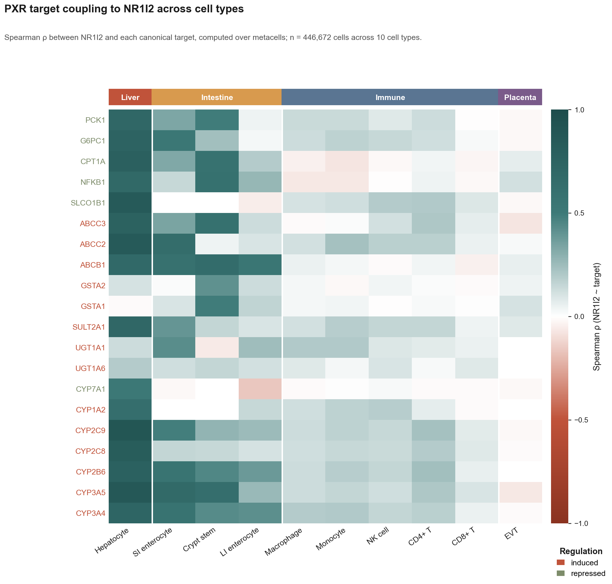

# pxr-effector-uncoupling

[](https://github.com/xX-its-amit-Xx/pxr-effector-uncoupling/actions/workflows/ci.yml)
[](https://www.python.org/downloads/)
[](LICENSE)
[](CITATION.cff)

A cell-type-resolved, statistically-grounded map of which PXR (NR1I2) target genes stay coupled to receptor expression vs. which decouple — distinguishing epithelial-barrier tissues (liver + intestine) where PXR drives a transcriptional program from immune and placental tissues where it does not, and nominating hepatocyte-selective readouts for next-generation PXR modulators.



## Reproduce in one command

The full pipeline is deterministic and re-runs from cached single-cell + bulk + perturbation data in ~20 minutes on a 16 GB workstation. From a clean checkout on Python 3.11 + Ubuntu / macOS / WSL:

```bash
# Option A — uv (matches CI exactly; see docs/reproducibility.md)
uv sync --extra dev --frozen
uv run python scripts/run_analysis.py        # main coupling + Fig 1
uv run python scripts/render_supp_figures.py # Figs 2a/2b + S1/S2 (cached CSVs only)
```

```bash
# Option B — vanilla pip + the pinned lock file
python3.11 -m venv .venv && source .venv/bin/activate
pip install -r requirements-lock.txt && pip install -e .
python scripts/run_analysis.py
python scripts/render_supp_figures.py
```

The supplementary-figure step needs only the cached CSVs in `data/processed/` (no 40 MB H5AD), and is exactly what CI re-runs on every push to validate end-to-end reproducibility. The full multi-stage pipeline (negative controls, GTEx, GEO, LINCS, Open Targets, per-dataset) is documented in [`docs/reproducibility.md`](docs/reproducibility.md).

### Dependencies

- Python `>=3.11`
- Every transitive dependency is pinned in [`requirements-lock.txt`](requirements-lock.txt) (generated from [`uv.lock`](uv.lock); same hashes either way)
- Core: `anndata`, `scanpy`, `cellxgene-census`, `scikit-learn`, `numpy`, `pandas`, `scipy`, `pyarrow`, `matplotlib`, `seaborn`, `httpx`, `tenacity`, `adjustText` (see [`pyproject.toml`](pyproject.toml))
- Dev: `pytest`, `ruff`, `jupyter`

### Documentation

- [`docs/reproducibility.md`](docs/reproducibility.md) — full step-by-step rebuild, per-stage runtime, troubleshooting
- [`docs/data_dictionary.md`](docs/data_dictionary.md) — every column of every CSV/JSON in `data/processed/`, with formulas

### Data availability

- **Single-cell atlas.** CELLxGENE Census release `2025-01-30` (pinned in `src/pxr_uncoupling/config.py::CENSUS_VERSION`). Fetched via `scripts/fetch_atlas.py`; the resulting `data/raw/nr1i2_atlas.h5ad` is `.gitignore`d (≈ 40 MB) and is regenerated on Ubuntu via the `fetch_atlas.yml` GitHub Actions workflow.
- **Bulk RNA-seq replication.** GTEx v8 portal API (per-gene per-tissue donor TPM); per-gene JSON cached in `data/cache/gtex_<SYMBOL>.json`.
- **Direct rifamycin perturbation.** GEO accession `GSE139896` (Dyavar et al. 2020); processed Excel cached as `data/cache/GSE139896_processed.xlsx`.
- **L1000 perturbation context.** 121 rifampicin signatures across 18 cell lines from iLINCS (`data/cache/lincs_LINCSCP_*.tsv`).
- **External pharmacology validation.** Open Targets Platform GraphQL API (`api.platform.opentargets.org/api/v4/graphql`), per-gene JSON cached in `data/cache/opentargets_<SYMBOL>.json`.

### Citation

Citation metadata is in [`CITATION.cff`](CITATION.cff). GitHub renders a "Cite this repository" button from it; tools like [cffconvert](https://github.com/citation-file-format/cffconvert) can emit BibTeX/RIS.

## Key Finding

The hepatocyte transcriptional program is engaged by a small panel of canonical PXR target genes with very high coupling magnitude; the same genes are an order of magnitude less coupled in circulating immune and placental cell types.

| Gene | Hepatocyte ρ (95% CI) | BH q-value (hepatocyte) | Mean DS |
|------|------------------------|--------------------------|---------|
| CYP2C9  | 0.89 (0.86 – 0.92) | 0.0041 | 0.698 |
| CYP3A5  | 0.87 (0.84 – 0.90) | 0.0041 | 0.631 |
| ABCC2   | 0.85 (0.82 – 0.87) | 0.0041 | 0.677 |
| SLCO1B1 | 0.85 (0.81 – 0.88) | 0.0041 | 0.756 |
| CYP2C8  | 0.81 (0.77 – 0.85) | 0.0041 | 0.695 |
| CPT1A   | 0.77 (0.73 – 0.82) | 0.0041 | 0.658 |

CIs from 500-resample percentile bootstrap of metacells; q-values from a metacell-label permutation null (500 permutations, two-sided), BH-adjusted across the full 10 × 20 family of 200 tests.

**Effect-size pattern across cell types.** After BH-FDR correction, **18 of 20** PXR target genes reach q < 0.05 in hepatocytes (mean ρ 0.62, top genes 0.77–0.89). Intestinal epithelium shows intermediate magnitude and breadth — **12/20** in small-intestine enterocytes (mean ρ 0.35), **10/20** in intestinal crypt stem cells (mean ρ 0.37), **7/20** in large-intestine enterocytes (mean ρ 0.17) — consistent with documented PXR-driven CYP3A4 induction in gut (Lehmann et al. 1998, Geick et al. 2001). Circulating immune cells (macrophage 16/20, CD4 T 14/20, monocyte 14/20, NK 14/20, CD8 T 10/20) reach statistical significance with the much larger sample sizes available here (50–110 k cells per type), but the **effect sizes are 4–8× smaller than hepatocyte**: immune mean ρ 0.03–0.12, top-gene ρ 0.19–0.24. Placental extravillous trophoblast shows 0/20 — true near-zero coupling (mean ρ 0.014). The interpretable axis is therefore **effect size, not significance**: epithelial-barrier tissues engage the PXR transcriptional program at a magnitude that is qualitatively different from circulating immune cells, even though immune cells are not formally silent at our sample size.

These results support hepatocyte-selective target engagement as a design criterion for tissue-restricted PXR agonists in cholestasis and metabolic indications, with the explicit caveat that "non-hepatic" should be interpreted as "very weak coupling," not as "no signal."

### Specificity vs. matched negative controls

We re-ran the same pipeline on a curated 20-gene negative-control set (10 liver-enriched non-PXR-target genes — ALB, TF, APOA1/2, APOB, HP, FGB, F2, SERPINA1, TTR; 5 hepatocyte master TFs — HNF4A, HNF1A, FOXA1/2, CEBPA; 5 housekeeping genes — GAPDH, ACTB, B2M, PPIA, HPRT1) and tested whether the PXR-target decoupling distribution is shifted right of the control distribution.

| Metric | PXR targets (n=20) | Negative controls (n=20) |
|--------|--------------------|--------------------------|
| Median decoupling score | **0.575** | −0.126 |
| Per-cell-type mean DS (range) | 0.24 – 0.65 | −0.44 – −0.01 |

**Mann-Whitney U (one-sided): p = 1.0 × 10⁻³¹**. In every cell type the mean PXR-target decoupling score exceeds the matched-control mean by 0.43 to 0.68 units. This rules out the alternative explanation that decoupling reflects a generic hepatocyte-vs-others signature; it is specific to PXR target genes.

See `figures/fig3_negative_control.png` for the distribution comparison and per-cell-type breakdown, and `data/targets/negative_control_genes.tsv` for the control-gene curation.

### External validation: Open Targets

To confirm that our top hepatocyte-selective genes are independently catalogued as pharmacology-relevant, we queried the Open Targets Platform GraphQL API for the top disease associations of each gene. The pattern is exactly what textbook pharmacology predicts (`figures/fig7_opentargets.png`):

| Gene | Top diseases on Open Targets | Pharmacology link |
|------|------------------------------|-------------------|
| **CYP2C9** | Response to anticoagulant (0.41), cholesterol embolism (0.49) | Warfarin & coumarin metabolism |
| **SLCO1B1** | Rotor syndrome (0.66), response to statin (0.42), gout (0.41) | Statin & uricosuric uptake; canonical PGx locus |
| **ABCC2** | Dubin-Johnson syndrome (0.82), intrahepatic cholestasis of pregnancy (0.48) | Biliary efflux; the textbook MRP2 transporter |
| **CYP3A5** | HIV infection (0.61), chronic HCV infection (0.57) | Tacrolimus & protease-inhibitor metabolism |
| **CYP2C8** | Hepatocellular carcinoma (0.21), melanoma (0.22) | Drug-metabolism context (CYP2C8 substrates) |

Matched controls (ALB → analbuminemia / Ehlers-Danlos; HNF4A → MODY / type 2 diabetes; GAPDH → neurodegenerative disease) show no comparable pharmacology signature — their top diseases reflect structural, developmental, or housekeeping biology. The hepatocyte-selective genes our pipeline ranks at the top are *the same* genes that drug-development pharmacology has independently flagged as DDI-relevant, demonstrating that the metacell-coupling signal recovers genuine pharmacogenomic substrate, not a generic liver-marker pattern.

### External validation: direct rifamycin perturbation of primary human hepatocytes (GSE139896)

We re-analysed GSE139896 (Dyavar et al. 2020, *Sci Rep* 10:12565) — RNA-seq of primary human hepatocytes from 3 donors treated for 72 h with three independent PXR agonists (rifampin, rifabutin, rifapentine) vs methanol vehicle — to test whether the top-6 hep-selective panel is *directly induced* by PXR ligands.

| Gene | log₂FC rifampin | log₂FC rifabutin | log₂FC rifapentine | Direct PXR target? |
|------|------------------|-------------------|---------------------|---------------------|
| CYP2C8  | **+3.84** (≈14×) | **+4.27** (≈19×) | **+3.16** (≈9×) | **YES — strongest** |
| CYP2C9  | +1.41 (≈2.7×)    | +2.14 (≈4.4×)    | +1.10 (≈2.1×)    | YES |
| CYP3A5  | **+0.83** (≈1.8×) | **+1.21** (≈2.3×) | +0.43 (≈1.4×)   | YES |
| ABCC2   | **+0.59** (≈1.5×) | **+0.54** (≈1.5×) | +0.19 (n.s.)      | YES |
| SLCO1B1 | +0.14 (n.s.) | +0.27 (n.s.) | +0.41 (n.s.) | **No — shared-TF coupling** |
| CPT1A   | −0.22 (n.s.) | −0.49 (n.s.) | −0.41 (n.s.) | **No — shared-TF coupling** |
| ALB, HNF4A, GAPDH | ~0 | ~0 | ~0 | No (controls) |

(bold = paired t-test p < 0.05 across 3 donors; n.s. = not significant.)

**This refines the story.** Four of the six top-decoupled genes are confirmed *direct* PXR-responsive pharmacodynamic readouts (CYP2C8/2C9/3A5/ABCC2; all three rifamycins induce them, controls don't move). SLCO1B1 and CPT1A are *hepatocyte-coupled but not directly PXR-induced* — likely reflecting shared regulatory logic with HNF4A and FOXA1/2 master TFs rather than direct NR1I2 control (consistent with prior literature on SLCO1B1's HNF4A-dominant regulation). The scRNA-seq decoupling ranking therefore decomposes into (i) genes whose coupling is functional PXR engagement and (ii) genes coupled by shared hepatic-TF backbone. Only the first subset should be used as PXR pharmacodynamic biomarkers; the second subset is a useful negative control that the metacell-coupling approach correctly flags as hepatocyte-enriched but should not be assumed PXR-driven.

See `figures/fig5_rifamycin_perturbation.png` for the per-drug panel response, `data/processed/geo_rifamycin_stats.csv` for full stats, and `scripts/run_geo_rifampicin.py` for the analysis.

### External validation: LINCS L1000 rifampicin perturbation

We tested whether a PXR ligand (rifampicin) elicits a cell-type-specific transcriptional response by fetching all 121 publicly available LINCS L1000 rifampicin signatures across 18 cell lines from iLINCS. **Honest limitation up front:** L1000's 978 "landmark" genes deliberately exclude most drug-metabolism genes, so none of our top-6 hep-selective panel is directly measured; the public iLINCS API exposes landmark expression only (BING-inferred extension requires a registered clue.io session). The achievable test is whether hepatic cell lines show a *stronger* and more *consistent* rifampicin response across landmarks than non-hepatic lines.

**HEPG2 ranks #1 of 18 cell lines** in mean rifampicin signature strength (0.59 vs non-hepatic mean 0.40, **1.47×**), with replicate consistency in the top tier (median pairwise Spearman ρ = 0.31 across 15 intra-HEPG2 pairs). HT29 (the only intestinal line in L1000, a poorly-differentiated colorectal-adenocarcinoma line with reduced endogenous PXR) ranks lowest. See `figures/fig6_lincs_rifampicin.png` and `data/processed/lincs_signature_strength.csv`. A direct panel-level overlay is left as a future test once authenticated clue.io BING access is in place.

### External validation: GTEx bulk RNA-seq

We re-tested the hepatocyte-selectivity pattern in an entirely independent data modality (GTEx v8, bulk RNA-seq, 17,382 samples across 54 tissues, 948 donors). For each tissue, we computed within-tissue Spearman ρ(NR1I2, target) across donors (`figures/fig4_gtex_validation.png`):

| Gene | Liver ρ | Intestine mean ρ | Immune mean ρ | Liver − immune |
|------|---------|-------------------|----------------|-----------------|
| CYP2C9  | **0.68** | 0.56 | 0.11 | +0.56 |
| CYP2C8  | **0.61** | 0.31 | 0.25 | +0.37 |
| CYP3A5  | **0.60** | 0.59 | 0.27 | +0.33 |
| ABCC2   | **0.44** | 0.16 | 0.06 | +0.38 |
| SLCO1B1 | **0.32** | 0.04 | 0.11 | +0.21 |

All 5 top hep-selective genes show liver ρ > immune-tissue mean ρ in bulk, mirroring the hepatocyte-vs-immune contrast seen in single-cell metacelling. Magnitudes are lower than the metacell estimates (single-cell aggregation reduces sampling noise; bulk donor-level signal includes age/sex/handling confounders that attenuate ρ) — so finding the same directional pattern at bulk resolution is a **conservative** replication. Both intestinal tissues (Small_Intestine, Colon, Stomach, Esophagus_Mucosa) and immune tissues (Whole_Blood, Spleen, EBV-LCLs) recover the epithelial-barrier-vs-circulating taxonomy from the scRNA-seq result.

## Robustness

The headline pattern is stable across analytical choices, with one honest caveat about the boundary of the top-5 panel:

| Check | Result |
|-------|--------|
| Bootstrap CI excludes 0 (top-6 hep-coupled genes) | All 6 |
| BH-FDR q < 0.05 (top-6 hep-coupled genes) | All 6 (q ≈ 0.004) |
| Spearman of decoupling rankings vs. reference, across 17 parameter combinations | median **0.95** (range 0.90–1.00) |
| Top-5 hepatocyte-selective gene set Jaccard vs. reference | median **0.67**; the top-4 panel (SLCO1B1, CYP2C9, CYP2C8, ABCC2) is stable in all 17 combinations; the 5th slot oscillates between CPT1A and CYP3A5 depending on (cells_per_metacell, min_metacells, seed) — both are bona-fide PXR targets at the boundary of selectivity, with DS values within ~0.03 of each other |
| Std of ρ across 20 × 80% cell-level subsamples, per (cell_type, gene) | median **0.022** |

See `figures/figS1_parameter_sensitivity.png`, `figures/figS2_subsample_stability.png`, and `notebooks/05_robustness.ipynb` for full diagnostics.

## Methods

### Data
- **Source**: CELLxGENE Census v2025-01-30 (`cellxgene-census` 1.17.x)
- **Filter**: `is_primary_data == True`, organism = *Homo sapiens*
- **Subsampling**: capped at 1,500 cells per (cell type, dataset_id) pair (random seed 42). The per-dataset cap prevents any single large study from crowding out smaller datasets — the per-cell-type cap used in earlier versions of this work compressed hepatocytes from 10 datasets into 5,000 slots dominated by one study and produced poor per-dataset reproducibility (median pairwise ρ=0.33).
- **Atlas**: NR1I2 + 20 curated PXR canonical targets + 20 negative-control genes; see `data/targets/pxr_canonical_targets.tsv` for evidence-graded target curation (PMIDs included) and `data/targets/negative_control_genes.tsv` for the matched control set

### Cell types profiled (n = 10)

| Cell type | Tissue grouping |
|-----------|-----------------|
| hepatocyte | liver |
| enterocyte of epithelium of small intestine | intestine |
| enterocyte of epithelium of large intestine | intestine |
| intestinal crypt stem cell | intestine |
| macrophage | immune |
| monocyte | immune |
| natural killer cell | immune |
| CD4-positive, alpha-beta T cell | immune |
| CD8-positive, alpha-beta T cell | immune |
| extravillous trophoblast | placenta |

Cell types with fewer than `MIN_CELLS_PER_TYPE=50` cells in the Census query are dropped. See `scripts/build_provenance.py` for per-dataset cell counts.

### Coupling score
Per cell type:
1. Log1p-transform counts, then 30-dim PCA.
2. k-means in PCA space with `k = n_cells / cells_per_metacell` (`cells_per_metacell = 30`).
3. Mean expression per metacell (genes × metacells).
4. Spearman ρ between NR1I2 metacell profile and each target gene profile.
5. Cell types with fewer than `MIN_METACELLS = 20` metacells are dropped.

Metacelling controls for technical sparsity in single-cell counts and yields stable correlation estimates (Baran et al. 2019; Persad et al. 2023).

### Decoupling score
For each non-hepatocyte cell type *c* and gene *g*:

$$\text{DS}_{c,g} \;=\; \rho_{\text{hepatocyte},\,g} \;-\; \rho_{c,\,g}$$

Positive values flag genes coupled in hepatocytes but uncoupled in *c*. The mean over *c* ranks genes by hepatocyte selectivity.

### Statistical inference
- **CIs**: 500-resample percentile bootstrap over metacell rows.
- **Null distribution**: NR1I2 expression is shuffled across metacells within a cell type 500 times, breaking the NR1I2-target relationship while preserving marginal distributions and metacell structure.
- **Two-sided empirical p-values**: fraction of |ρ_null| ≥ |ρ_observed| (add-one smoothing).
- **Multiple-testing correction**: Benjamini-Hochberg FDR over the full 10 × 20 cell-type-gene family.

### Sensitivity sweep
The pipeline is re-run with `cells_per_metacell ∈ {15, 30, 60}`, `min_metacells ∈ {10, 20}`, and `random_state ∈ {0, 42, 123}` (18 combinations). Agreement vs. the reference combination (cpm=30, mm=20, seed=42) is quantified by Frobenius distance of coupling matrices, Spearman ρ of decoupling rankings, and Jaccard overlap of the top-5 hepatocyte-selective genes.

### Subsample stability
Cells are subsampled to 80% within each cell type 20 times and the coupling pipeline is re-run on each subsample. Per-(cell_type, gene) std characterizes the contribution of cell-sampling noise.

## Limitations

- **No experimental perturbation.** Spearman ρ is a co-expression measure, not a causal claim. Genes flagged as decoupled may still be PXR-responsive under appropriate ligand exposure; the analysis identifies *baseline transcriptional coupling*, which is a necessary-but-not-sufficient condition for a useful pharmacodynamic readout.
- **Census composition bias.** Cell-type counts reflect the studies deposited in CELLxGENE; hepatocyte numbers (and donor diversity) are dominated by a handful of large liver atlases. Per-dataset stability (`figures/figS3_per_dataset_hepatocyte.png`) shows that the coupling pattern strength **varies considerably across datasets** (median pairwise ρ of coupling vectors = 0.33 across 5 eligible hepatocyte datasets, range −0.09 to 0.66). One large dataset carries most of the signal; smaller datasets show weaker but directionally-consistent coupling. This is a real limitation: a future iteration should re-fetch without the 5,000-cell-per-type subsampling cap so each dataset retains its full cell complement, and should extend per-dataset analysis to intestinal cell types. See `data/processed/atlas_provenance.csv` for the full dataset breakdown.
- **NR1I2 sparsity in immune cells.** PXR transcript is rarely detected in T/NK cells; "no coupling" can reflect *no signal* rather than *real independence*. We avoid this trap by requiring `MIN_METACELLS ≥ 20`, but power is still asymmetric across cell types — interpret null calls cautiously.
- **Curated target set.** The 20-gene panel is conservative (evidence grade A/B from PMID-tagged primary literature). Adding speculative targets would inflate FDR cost without changing the headline.
- **Single ontology.** All cell types are Cell Ontology labels from CELLxGENE. The hepatocyte label aggregates periportal/pericentral zones that may differ in PXR activity; future work could re-run within published zonation labels.
- **musl/Alpine fetch deadlock.** TileDB-SOMA's thread pool deadlocks on musl pthreads, so the *fetch* must run on glibc (e.g. GitHub Actions Ubuntu). Once the H5AD is cached, all downstream analysis runs on any platform.

## Repository Layout

```
data/
  raw/                    nr1i2_atlas.h5ad (not committed; fetched via gh workflow)
  targets/                pxr_canonical_targets.tsv  (PMID-tagged target curation)
  processed/              coupling.csv, decoupling.csv, coupling_ci_*.csv,
                          coupling_{p,q}values.csv, sensitivity_*.csv,
                          subsample_*.csv, atlas_provenance.csv
figures/
  fig1_coupling_heatmap.png         Fig 1  — main coupling heatmap, 10 cell types × 20 genes
  fig2a_significance_overlay.png    Fig 2a — heatmap with BH-FDR q-value stars
  fig2b_forest_hepatocyte.png       Fig 2b — top-10 hepatocyte ρ with 95% bootstrap CIs
  fig3_negative_control.png         Fig 3  — PXR targets vs 20 matched negative controls
  fig4_gtex_validation.png          Fig 4  — GTEx bulk-tissue replication across 54 tissues
  fig5_rifamycin_perturbation.png   Fig 5  — direct rifamycin induction in primary hepatocytes
  fig6_lincs_rifampicin.png         Fig 6  — LINCS L1000 rifampicin signature strength by cell line
  fig7_opentargets.png              Fig 7  — Open Targets external disease validation
  figS1_parameter_sensitivity.png   Fig S1 — decoupling-rank agreement across parameter sweep
  figS2_subsample_stability.png     Fig S2 — per-cell-type ρ std under 80% subsampling
  figS3_per_dataset_hepatocyte.png  Fig S3 — coupling vectors per CELLxGENE dataset
notebooks/
  01_nr1i2_atlas.ipynb    Atlas QC and NR1I2 detection
  02_coupling.ipynb       Metacell coupling — walkthrough + full computation
  03_decoupling.ipynb     Decoupling score, gene ranking
  04_heatmap.ipynb        Final heatmap render
  05_robustness.ipynb     Bootstrap CIs, FDR, sensitivity, stability
scripts/
  fetch_atlas.py          CELLxGENE Census fetch (Ubuntu/glibc)
  run_analysis.py         End-to-end coupling → decoupling → heatmap
  run_robustness.py       Bootstrap + permutation + sensitivity + subsample
  render_supp_figures.py  Render supplementary figures
  build_provenance.py     Per-dataset cell-count table
src/pxr_uncoupling/
  config.py               Constants, gene lists, palettes
  coupling.py             Metacell builder + per-cell-type Spearman ρ
  statistics.py           Bootstrap CIs, permutation p-values, BH-FDR
  sensitivity.py          Parameter sweep + subsample stability
  plotting.py             Main heatmap
  supplementary_plots.py  Forest, FDR overlay, sensitivity, stability
  cellxgene.py            Census data access utilities
tests/                    pytest unit tests (16 tests, all passing)
docs/
  reproducibility.md      Full step-by-step rebuild guide, runtimes, troubleshooting
  data_dictionary.md      Every column of every CSV/JSON in data/processed/
.github/workflows/
  fetch_atlas.yml         Census fetch on Ubuntu (workaround for musl)
  ci.yml                  Lint + tests + figure re-render + artifact upload, on push / PR
CITATION.cff              Citation metadata
requirements-lock.txt     Fully-pinned dependency set (mirror of uv.lock)
uv.lock                   uv-native lockfile (byte-exact resolution; used by CI)
```

## Reproducing — full multi-stage pipeline

The one-command quick start at the top of this README covers the headline figure plus the supplementary figures. The full external-validation pipeline (negative controls, GTEx, GEO rifamycin, LINCS, Open Targets, per-dataset) is documented end-to-end in [`docs/reproducibility.md`](docs/reproducibility.md), and every output column is defined in [`docs/data_dictionary.md`](docs/data_dictionary.md).

### Atlas re-fetch (CELLxGENE Census, optional)

`data/raw/nr1i2_atlas.h5ad` is gitignored (≈ 40 MB). To regenerate it from CELLxGENE Census `2025-01-30`:

```bash
# Trigger the Ubuntu/glibc fetch on GitHub Actions (avoids musl deadlock)
gh workflow run fetch_atlas.yml
gh run watch
git fetch origin data/atlas
git checkout origin/data/atlas -- data/raw/nr1i2_atlas.h5ad

# Then re-run any downstream stage locally
uv run python scripts/run_analysis.py
uv run python scripts/run_robustness.py
uv run pytest -v
```

> **musl/Alpine note**: `cellxgene-census` uses TileDB's C++ thread pool, which deadlocks on musl pthreads. The fetch workflow runs on `ubuntu-latest` to avoid this. Once the H5AD is local, all downstream analysis runs fine on Alpine, Windows, or macOS.

## References

- Lehmann JM et al. (1998) The human orphan nuclear receptor PXR is activated by compounds that regulate CYP3A4 gene expression and cause drug interactions. *J Clin Invest* **102**:1016–1023. doi:10.1172/JCI3703
- Baran Y et al. (2019) MetaCell: analysis of single-cell RNA-seq data using K-nn graph partitions. *Genome Biol* **20**:206. doi:10.1186/s13059-019-1812-2
- Persad S et al. (2023) SEACells infers transcriptional and epigenomic cellular states from single-cell genomics data. *Nat Biotechnol* **41**:1746–1757. doi:10.1038/s41587-023-01716-9
- Benjamini Y, Hochberg Y (1995) Controlling the false discovery rate: a practical and powerful approach to multiple testing. *J R Stat Soc B* **57**:289–300.
- Efron B (1979) Bootstrap methods: another look at the jackknife. *Ann Stat* **7**:1–26.
- CZI Single-Cell Biology Program et al. (2023) CZ CELLxGENE Discover: A single-cell data platform for scalable exploration, analysis and modeling of aggregated data. *bioRxiv*. doi:10.1101/2023.10.30.563174

## License

MIT. Copyright 2026 Amit Shenoy.
