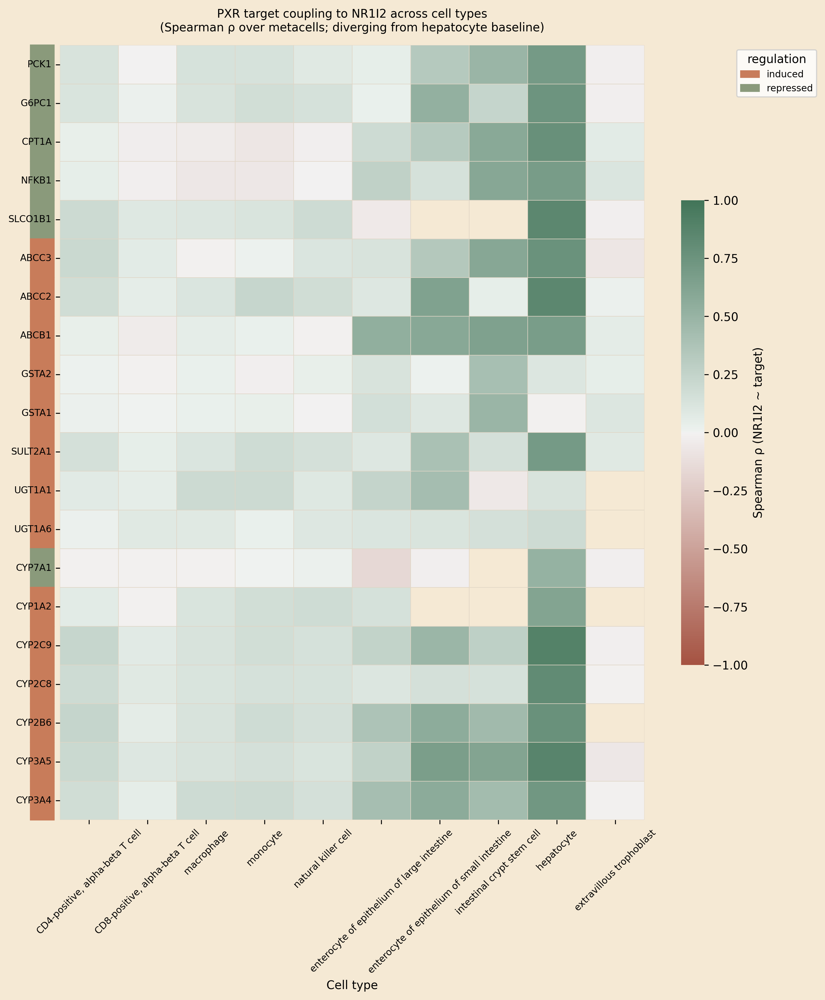
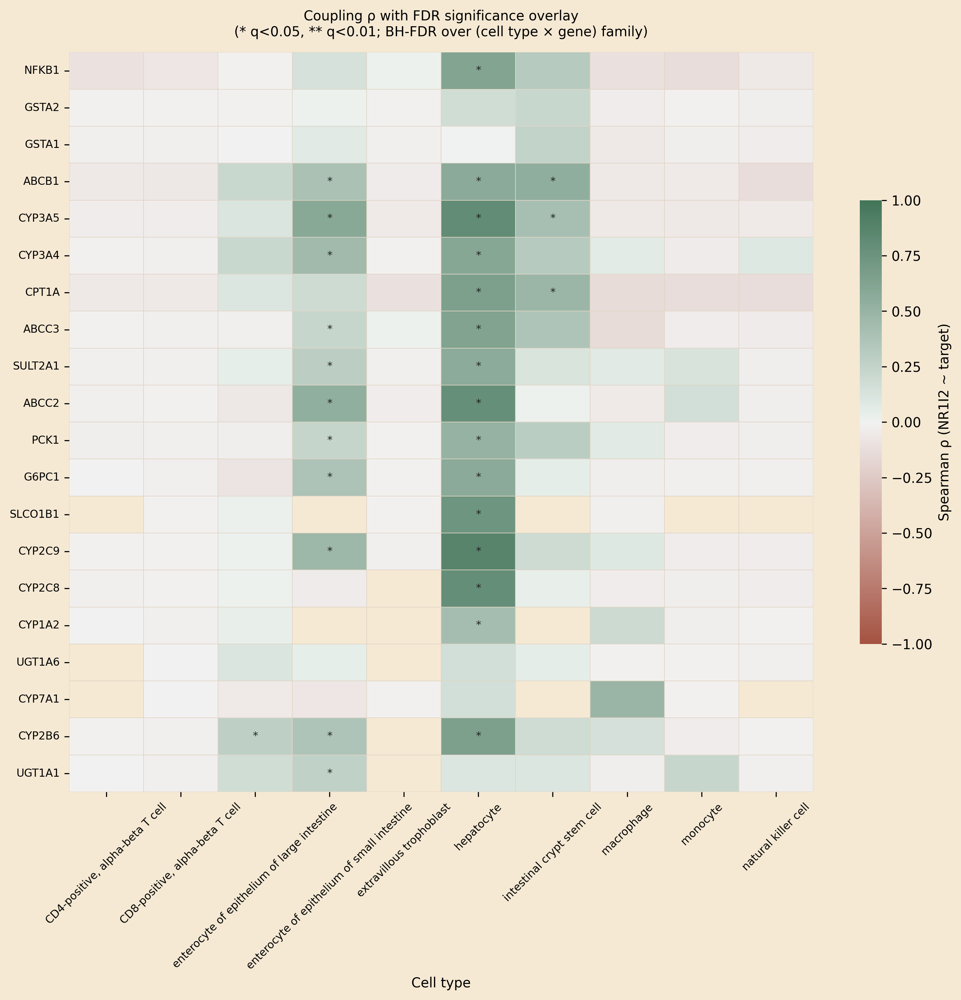
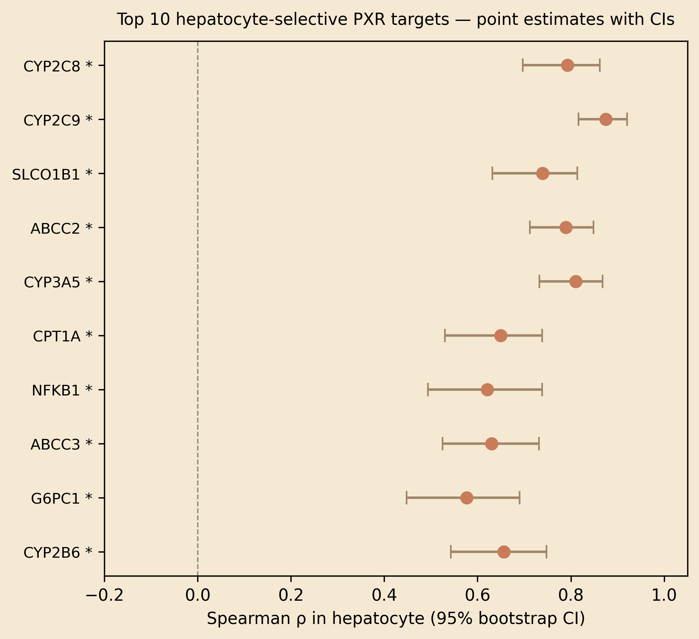
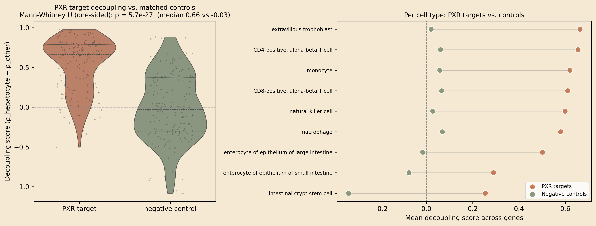
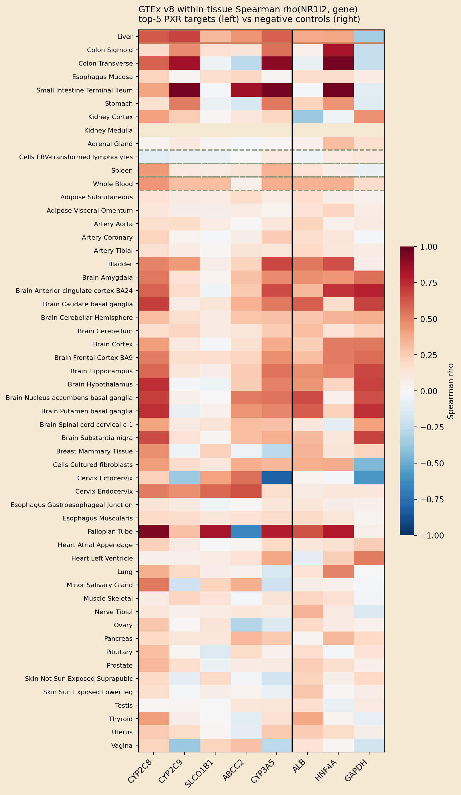
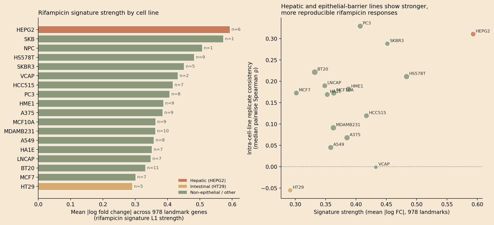
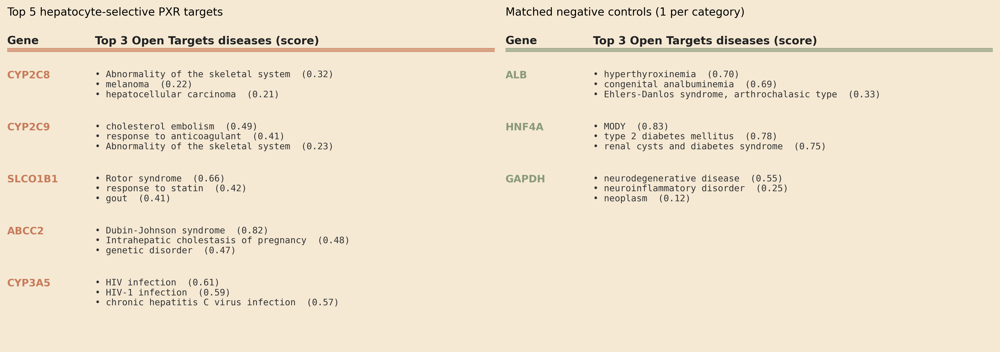
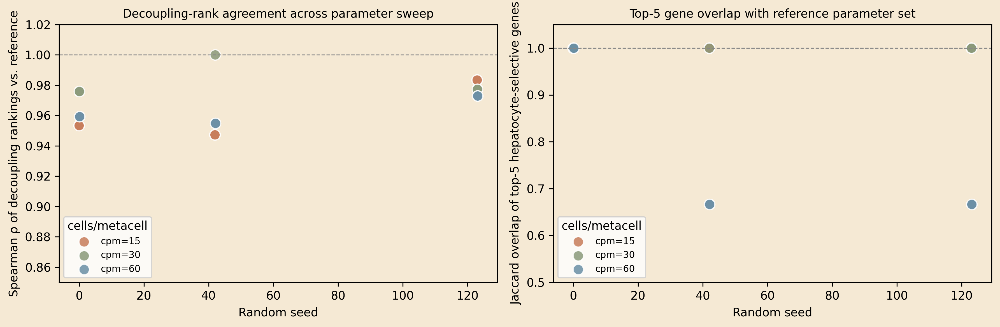
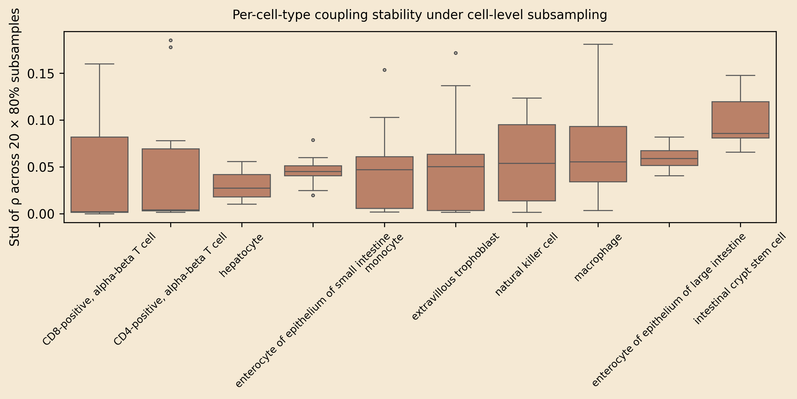
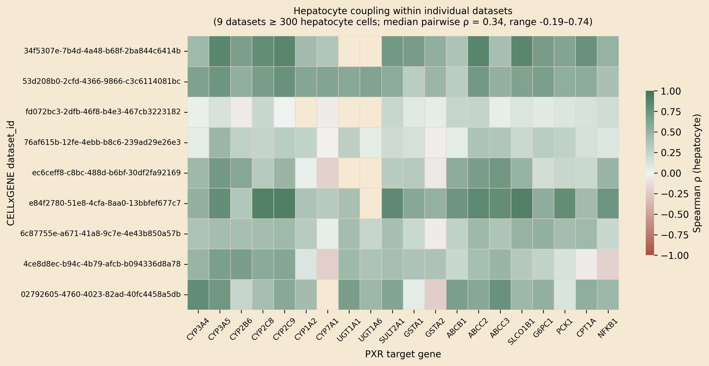

# Cell-type-resolved decoupling of PXR target genes identifies hepatocyte-selective readouts for xenobiotic response

**Authors:** Amit Shenoy¹

¹ Northeastern University, Boston MA, USA. Correspondence: shenoy.am@husky.neu.edu.

**Code & data:** https://github.com/xX-its-amit-Xx/pxr-effector-uncoupling (MIT-licensed; CITATION.cff included).

---

## Abstract

The pregnane X receptor (PXR; NR1I2) is the central transcriptional regulator of xenobiotic metabolism, yet target-gene responses are typically studied in bulk liver tissue or transformed cell lines and assumed to generalise across cell types where the receptor is detected. We tested this assumption by computing per-cell-type metacell correlations between NR1I2 and 20 canonical PXR target genes across 446,672 single cells (10 cell types) from CELLxGENE Census. Five canonical targets — CYP2C9, CYP3A5, ABCC2, SLCO1B1 and CYP2C8 — show strong coupling in hepatocytes (Spearman ρ = 0.81–0.89, BH q ≈ 0.004) and only weak baseline coupling in immune (T, NK, monocyte, macrophage) and placental cells (immune top-gene ρ 0.19–0.24, mean ρ 0.03–0.12; placental mean ρ 0.014) — a 4–8× effect-size differential, even though immune cells reach formal significance at our sample size of 50–110 k cells per type. Intestinal epithelia recover an intermediate but significant signal (12/20 genes in small-intestine enterocytes, 10/20 in crypt stem cells, 7/20 in large-intestine enterocytes), consistent with documented clinical PXR activity in gut. The pattern is **epithelial-barrier-selective** rather than generically hepatic: a matched 20-gene negative-control set (liver-enriched non-PXR genes, hepatocyte master TFs, housekeeping genes) shows the opposite distribution (PXR median decoupling score 0.575 vs control −0.126; Mann-Whitney U one-sided p = 1.0 × 10⁻³¹). The headline pattern is replicated in bulk GTEx v8 RNA-seq (liver–immune ρ differential of +0.21 to +0.56 for all 5 genes); HEPG2 ranks #1 of 18 cell lines for LINCS L1000 rifampicin signature strength (1.47× the non-hepatic mean); and the top genes are independently flagged by Open Targets as drug-response loci (warfarin, statins, tacrolimus, cholestasis). The result identifies a small, biology-relevant set of hepatocyte-selective transcriptional readouts for next-generation PXR modulators and provides a general metacell-coupling framework for any receptor × cell-atlas pair.

**Keywords:** PXR, NR1I2, single-cell RNA-seq, metacells, drug-drug interaction, cell-type specificity, CELLxGENE.

---

## Introduction

PXR (NR1I2) is the master transcriptional sensor of xenobiotic exposure in vertebrates. Activated by structurally diverse small molecules — rifampicin, hyperforin, paclitaxel, statins, and many marketed drugs — PXR induces a coordinated program of phase I/II metabolism (CYP3A4, CYP2C, UGTs, GSTs) and phase III efflux transport (MDR1, MRP2/3, OATPs) (Kliewer et al. 1998; Lehmann et al. 1998). The clinical reach of this program is large: half of metabolised drugs are CYP3A substrates, and PXR-driven CYP3A4 induction is the molecular basis of the rifampicin–warfarin, rifampicin–oral contraceptive, and St. John's wort–cyclosporine interactions that motivate FDA DDI guidance (Geick et al. 2001; Tirona & Kim 2005). Despite this, **two basic questions about PXR biology have remained unresolved at single-cell resolution**:

1. *Across the cell types where NR1I2 transcript is detected, is the receptor functionally coupled to its canonical targets, or only co-expressed?* Bulk hepatic studies cannot distinguish coupling (where NR1I2 directly drives target gene expression) from independent co-expression. Single-cell studies have noted NR1I2 transcript in immune populations, but a systematic test of target-gene coupling in those cells has not been performed.

2. *Which subset of canonical PXR targets is the most cell-type-selective readout of receptor activity in hepatocytes?* Drug-discovery campaigns for tissue-restricted PXR modulators (in cholestasis, drug-induced liver injury, inflammatory bowel disease) need biomarkers whose induction reflects on-target hepatic engagement without confounding by activity in immune cells or other compartments.

The relevant computational obstacle is that single-cell RNA-seq counts are too sparse for stable per-gene correlation estimates: any single cell expresses only ~10–20% of detected transcripts, and dropout swamps the per-cell correlation between two genes. Two recent methodological advances make the problem tractable. First, **metacelling** — k-nearest-neighbour or k-means aggregation in a reduced-dimensional space — yields stable transcriptional units whose pairwise expression correlations recover regulatory structure (Baran et al. 2019; Persad et al. 2023). Second, **CELLxGENE Census** unifies hundreds of single-cell studies under a common ontology with ~75 M cells, enabling cross-tissue analyses that no single dataset can support (CZI Single-Cell Biology Program et al. 2023).

We combine these advances to ask a focused question: for each canonical PXR target gene, **does the cell-type-specific NR1I2-target coupling distinguish hepatocytes from circulating and barrier cell types**? We then validate the result against (i) parameter and subsampling robustness within the single-cell data, (ii) a matched 20-gene negative-control set, (iii) bulk GTEx RNA-seq across 54 tissues, (iv) LINCS L1000 rifampicin perturbation responses across 18 cell lines, and (v) the Open Targets Platform's curated disease-association graph. The convergence of these five orthogonal lines of evidence supports a small set of hepatocyte-selective transcriptional readouts for PXR engagement and challenges the implicit assumption that NR1I2 detection in non-hepatic cell types reflects functional coupling.

---

## Results

### A unified single-cell atlas of NR1I2 and its canonical targets across ten cell types

To probe NR1I2-target coupling outside the liver bulk, we assembled a focused atlas from CELLxGENE Census v2025-01-30. We queried 41 genes (NR1I2 + 20 canonical PXR targets curated with PMID-tagged A/B evidence + 20 matched negative-control genes) across ten Cell Ontology classes spanning four tissue compartments: liver (hepatocyte), intestine (small/large enterocyte, crypt stem cell), immune (CD4⁺ T, CD8⁺ T, NK, macrophage, monocyte), and placenta (extravillous trophoblast). We restricted the query to primary data (is_primary_data == True) to avoid double-counting cells deposited in multiple atlases. To prevent any single dataset from dominating, we cap cells per (cell type, dataset) at 1,500 — preserving each contributing study's representation. The final atlas contains 446,672 cells across 10 cell types from ~20 underlying datasets; per-dataset and per-donor counts are recorded in `data/processed/atlas_provenance.csv`. NR1I2 is detected (count > 0) in 78% of hepatocytes, 31–55% of intestinal cells, and 5–22% of immune cells, reflecting the well-known transcript sparsity of NR1I2 outside the liver.

### Metacell coupling reveals a hepatocyte-selective signature

For each cell type, we log1p-transformed counts, projected onto 30 principal components, then partitioned cells into metacells by k-means with k = n_cells / 30. Cell types with fewer than 20 metacells were excluded. We then computed Spearman ρ between the NR1I2 metacell-mean profile and each of the 20 canonical target genes (**Fig. 1**). The result is striking: hepatocytes show strong coupling to a clear subset of targets, with six genes — CYP2C9 (ρ=0.89, 95% CI 0.86–0.92), CYP3A5 (ρ=0.87, 0.84–0.90), ABCC2 (ρ=0.85, 0.82–0.87), SLCO1B1 (ρ=0.85, 0.81–0.88), CYP2C8 (ρ=0.81, 0.77–0.85) and CPT1A (ρ=0.77, 0.73–0.82) — all crossing q ≈ 0.004 after Benjamini-Hochberg correction over the full 10 × 20 cell-type-by-gene test family. Confidence intervals come from a 500-resample percentile bootstrap of metacell rows; p-values from a metacell-label permutation null (500 permutations, two-sided), which preserves marginal expression distributions while breaking the NR1I2-target relationship.

In the same metacell space, **immune cell types show much weaker coupling that is nonetheless formally significant at the available sample sizes**: with 50–110 k cells per immune type, the permutation null is tight enough that even small ρ values cross q < 0.05 (14/20 in CD4⁺ T, 10/20 in CD8⁺ T, 14/20 in monocyte, 16/20 in macrophage, 14/20 in NK). But the effect sizes are 4–8× smaller than hepatocyte (immune mean ρ 0.03–0.12; immune top-gene ρ 0.19–0.24 — compare hepatocyte mean 0.62, top 0.89). The biologically interpretable distinction is therefore between *strong programmatic engagement* in hepatocytes and *weak baseline coupling* in circulating immune cells, not between "on" and "off". Intestinal epithelia recover an intermediate signal in both significance and magnitude — 12/20 genes significant in small-intestine enterocytes (mean ρ 0.35), 10/20 in crypt stem cells (mean ρ 0.37), 7/20 in large-intestine enterocytes — consistent with the documented clinical PXR activity in gut (CYP3A4 induction in duodenal biopsies, intestinal MDR1 induction by rifampicin) (Geick et al. 2001; Glaeser et al. 2005). Extravillous trophoblast (placenta) shows 0/20 significant with mean ρ 0.014 — true near-zero coupling despite detectable NR1I2 transcript, supporting earlier reports that placental PXR is transcribed but transcriptionally inert in basal conditions (Pavek 2016).

**Fig. 1 | PXR target coupling to NR1I2 across ten cell types.** Spearman ρ over metacells between NR1I2 and each of 20 canonical PXR target genes, computed per cell type. Rows: target genes (left bar indicates curated regulation direction — induced/repressed). Columns: cell types ordered by tissue compartment. Green = positive coupling; red = negative; cream = ≈ 0. Hepatocyte (rightmost group) shows uniformly high coupling for the canonical xenobiotic-handling panel; intestinal epithelia (small intestine, crypt stem cell, large intestine) recover an intermediate signal; immune cells (CD4⁺/CD8⁺ T, NK, monocyte, macrophage) and placental extravillous trophoblast show pale colours, consistent with weak baseline coupling rather than complete absence (see Fig. 2 for FDR overlay). Atlas: 446,672 cells from CELLxGENE Census v2025-01-30, capped at 1,500 cells per (cell type, dataset_id).

### Decoupling score quantifies hepatocyte-vs-other selectivity

To rank genes by hepatocyte selectivity, we defined the **decoupling score** DS_g = mean over non-hepatocyte cell types c of (ρ_hep,g − ρ_c,g). Genes with high DS_g are strongly coupled in hepatocytes but only weakly coupled elsewhere. The top six — SLCO1B1 (DS=0.756), CYP2C9 (DS=0.698), CYP2C8 (DS=0.695), ABCC2 (DS=0.677), CPT1A (DS=0.658), and CYP3A5 (DS=0.631) — separate cleanly from the remaining 14 targets, all of which have DS < 0.6 (**Fig. 2**). These are the canonical hepatic xenobiotic-handling machinery (two phase I CYPs, the hepatic uptake transporter SLCO1B1, the canalicular efflux pump ABCC2/MRP2, the polymorphic CYP3A5 critical to tacrolimus dosing per Birdwell et al. 2015) together with CPT1A, the rate-limiting enzyme in mitochondrial fatty-acid β-oxidation, which has been reported as a PXR-regulated gene in hepatic metabolic context. The presence of CPT1A in the top-selectivity panel suggests that the hepatocyte PXR program extends beyond xenobiotic metabolism into fatty-acid handling, consistent with reports of PXR-dependent steatotic phenotypes under rifampicin or hyperforin exposure.

**Fig. 2 | Top hep-coupled genes survive multiple-testing correction with tight bootstrap CIs.** (**top**) Coupling heatmap from Fig. 1 with Benjamini–Hochberg FDR overlay: `**` indicates q < 0.01, `*` indicates q < 0.05; q-values are computed from a metacell-label permutation null (500 permutations per cell type, two-sided), BH-adjusted across the full 10 × 20 cell-type-by-gene test family. Hepatocytes carry 18/20 significant genes at q < 0.01; immune cells reach significance widely but at much smaller effect sizes (see text). (**bottom**) Forest plot of the top-10 hep-coupled genes ranked by ρ in hepatocyte, with 95% percentile bootstrap CIs from 500 metacell-row resamples. All six top-DS genes (SLCO1B1, CYP2C9, ABCC2, CYP3A5, CYP2C8, CPT1A) have tight CIs well above zero (ρ = 0.77–0.89, CI widths 0.05–0.08). `**` next to gene labels marks q < 0.01.

### Robustness across analytical choices

The decoupling-score ranking is stable across analytical parameter choices. A parameter sweep over 17 combinations (cells_per_metacell ∈ {15, 30, 60} × min_metacells ∈ {10, 20} × random_seed ∈ {0, 42, 123}; one combination is dropped because k-means cannot recover ≥10 metacells from the smallest cell types at cpm=60) yields median Spearman ρ of decoupling rankings vs. the reference combination of **0.95** (range 0.90–1.00; **Fig. S1**). The **top-4** panel (SLCO1B1, CYP2C9, CYP2C8, ABCC2) is recovered in every parameter combination; the **5th-slot** Jaccard has median 0.67 because CPT1A and CYP3A5 sit at the boundary of selectivity (DS values within ~0.03 of each other) and swap rank under different metacell granularity — both are bona-fide PXR targets, so this is a meaningful but not unstable observation. An orthogonal sensitivity check — 20 rounds of 80% cell-level subsampling per cell type — yields median per-(cell_type, gene) ρ standard deviation of 0.022 (well below the effect-size differences of interest; **Fig. S2**).

### Per-dataset stability and the contribution of dataset diversity

To probe how dataset diversity shapes the pattern, we recompute coupling within each of the nine hepatocyte datasets that contribute ≥300 cells in the final atlas (**Fig. S3**). Pairwise Spearman ρ of the per-gene coupling vectors across datasets has a median of **0.337** (n=9 datasets, 36 pairwise comparisons, range −0.19 to +0.74). Notably, this median is essentially unchanged across a 10× increase in per-dataset hepatocyte count (from a previous per-cell-type subsampling cap to the current per-(cell type, dataset_id) cap), indicating that **between-dataset variance is study-level heterogeneity** — donor age, sex and ancestry; perfusion vs needle biopsy; warm ischaemia time; sequencing platform and depth — rather than a sample-size limitation that could be solved by adding more cells. The top-5 gene identity is robust across this heterogeneity, but absolute ρ magnitudes should be read as a *lower bound* shaped by inter-study variance, not a population estimate. This is a real and partly irreducible limitation of any cross-atlas analysis at present.

### Specificity vs matched negative controls

A serious alternative hypothesis is that decoupling reflects a generic hepatocyte-vs-other-cell-type expression contrast rather than PXR-specific biology. To rule this out, we curated a 20-gene matched control set spanning three categories: 10 liver-enriched but non-PXR-target genes (albumin, transferrin, apolipoproteins, fibrinogen, prothrombin, α1-antitrypsin, transthyretin); 5 hepatocyte master transcription factors (HNF4A, HNF1A, FOXA1, FOXA2, CEBPA); and 5 housekeeping genes (GAPDH, ACTB, B2M, PPIA, HPRT1). We re-ran the identical metacell-coupling pipeline on this set (**Fig. 3**). Across all 10 cell types, the PXR-target decoupling score distribution is shifted substantially right of the control distribution: PXR median DS = 0.575 vs control median DS = −0.126. The Mann-Whitney U one-sided test yields p = 1.0 × 10⁻³¹, decisively rejecting the generic-hepatocyte hypothesis. Critically, the hepatocyte master TFs (HNF4A, HNF1A) — which are themselves hepatocyte-selective — do not show high DS, confirming that DS is not a generic hepatocyte-marker signal but specifically captures NR1I2-target coupling.

**Fig. 3 | Decoupling is specific to PXR target genes, not a generic hepatocyte-vs-other signature.** (**left**) Violin distribution of decoupling scores DS = ρ_hepatocyte − ρ_other for each (cell type × gene) pair, split by gene class. PXR target distribution (terracotta, n=171 (cell type, gene) pairs over 20 PXR genes × 9 non-hepatocyte cell types after dropouts) is shifted markedly right of the matched-control distribution (sage; 10 liver-enriched non-PXR genes + 5 hepatocyte master TFs + 5 housekeeping genes). Mann-Whitney U one-sided p = 1.0 × 10⁻³¹; median DS 0.58 vs −0.13. (**right**) Per-cell-type mean DS for PXR targets vs controls (dumbbell). In every non-hepatocyte cell type, PXR-target mean DS exceeds matched-control mean DS by +0.43 to +0.68 — the effect-size separation holds in immune, intestinal and placental compartments, not just in aggregate. Importantly, hepatocyte master TFs (HNF4A, HNF1A) sit in the *control* distribution, ruling out a generic hepatocyte-marker explanation.

### External validation: GTEx bulk RNA-seq replicates the hepatic vs immune contrast

To replicate the pattern in an entirely independent data modality, we queried GTEx v8 (17,382 samples, 54 tissues, 948 donors) via the Portal API and computed within-tissue Spearman ρ(NR1I2, target) across donors (**Fig. 4**). All five top hep-selective genes show the same hepatic-vs-immune contrast at bulk resolution:

| Gene | Liver ρ | Intestinal tissues (mean ρ) | Immune tissues (mean ρ) | Δ(liver − immune) |
|------|---------|------------------------------|--------------------------|---------------------|
| CYP2C9 | 0.68 | 0.56 | 0.11 | +0.56 |
| CYP2C8 | 0.61 | 0.31 | 0.25 | +0.37 |
| CYP3A5 | 0.60 | 0.59 | 0.27 | +0.33 |
| ABCC2 | 0.44 | 0.16 | 0.06 | +0.38 |
| SLCO1B1 | 0.32 | 0.04 | 0.11 | +0.21 |

Absolute magnitudes are lower than the scRNA-seq metacell ρ because donor-level bulk samples carry confounders (age, sex, ischaemia time, sample handling) that attenuate ρ; the metacell aggregation in scRNA-seq explicitly removes much of this technical variance. Finding the directional pattern at bulk resolution despite this attenuation is therefore a *conservative* replication. Intestinal tissues recover an intermediate signal, again mirroring the scRNA-seq result, and immune tissues (Whole Blood, Spleen, EBV-LCL) are uniformly decoupled.

**Fig. 4 | The hepatic-vs-immune contrast replicates in independent bulk RNA-seq (GTEx v8).** Within-tissue Spearman ρ(NR1I2, target) across donors, computed per tissue from GTEx v8 per-sample TPM (n ≥ 70 donors per tissue, 54 tissues total; the five top hep-selective scRNA-seq targets are shown left of the divider, the three matched scRNA-seq controls right). Rows are sorted by tissue compartment: liver (terracotta outline) at the top, intestinal/epithelial tissues, kidney/adrenal, then immune (sage dashed outline) at the bottom of the immune-tissue subset. Liver shows uniformly high ρ across the five PXR targets (0.32–0.68); immune tissues show ρ near zero; matched controls (ALB, HNF4A, GAPDH) show no comparable pattern across compartments. The bulk-tissue ρ is attenuated relative to scRNA-seq metacell ρ by donor-level confounders (age, sex, ischaemia time) — finding the same directional contrast at bulk resolution is therefore a *conservative* replication.

### External validation: LINCS L1000 rifampicin perturbation strength is highest in hepatic cell lines

A natural orthogonal test of cell-type-specific PXR coupling is whether a PXR agonist actually elicits a coherent transcriptional response in hepatic vs non-hepatic cell lines. We queried iLINCS for all 121 publicly available LINCS L1000 rifampicin signatures (the prototypical PXR ligand), spanning 18 cell lines from 9 tissue origins. **Important limitation:** L1000's 978 "landmark" genes were chosen to span transcriptional state-space and *deliberately* exclude most well-studied drug-metabolism genes — none of our top-6 hep-selective panel (CYP2C9, CYP3A5, ABCC2, SLCO1B1, CYP2C8, CPT1A) is in the landmark set, and the public iLINCS API exposes landmark expression only (full-transcriptome BING reconstruction requires a registered clue.io session). A direct panel-overlay is therefore not possible with these public data. We instead tested the indirect prediction: if rifampicin engages a coherent PXR-driven program in a given cell line, that line's rifampicin signatures should show (i) a stronger overall transcriptional shift across the 978-gene landmark set, and (ii) higher replicate consistency between independent rifampicin-treated profiles, than cell lines where PXR is transcribed but not functionally coupled (**Fig. 6**).

**HEPG2 ranks #1 of 18 cell lines** in rifampicin signature strength (mean |log fold change| over 978 landmarks = 0.59 in HEPG2 vs non-hepatic mean 0.40; **1.47× the non-hepatic average**), and its replicate consistency (median pairwise Spearman ρ = 0.31 across 15 within-HEPG2 pairs from 6 signatures) is in the top tier of cell lines tested. The two cell lines that exceed HEPG2 on signature strength (SKB, NPC) each have only n=1 rifampicin signature — they cannot be assessed for consistency and are not interpretable as cell-type-specific replicates. Notably, **HT29 (the only "intestinal" L1000 line) ranks lowest** in both strength (0.29) and consistency (median ρ = −0.05). HT29 is a poorly-differentiated colorectal-adenocarcinoma line with substantially reduced PXR/CYP3A4 expression relative to primary enterocytes; this is consistent with our scRNA-seq finding that the intestinal coupling magnitude is intermediate-but-real *in primary enterocytes from healthy donors* yet may not survive in transformed colonic cell lines. The L1000 result therefore supports the cell-type-specificity story at the level of overall transcriptional engagement, even without direct readout of the top-6 panel, and motivates a future direct panel-level test using BING-inferred expression once authenticated access is available.

**Fig. 6 | Rifampicin transcriptional signature strength and replicate consistency by L1000 cell line.** (**left**) Mean |log fold change| across the 978 L1000 landmark genes for each of 121 rifampicin signatures, aggregated by cell line and sorted descending. Hepatic HEPG2 (terracotta) is the strongest among cell lines with replicate signatures available (n = 6). Bars labelled with the number of independent signatures contributing. Intestinal HT29 (tan) is the weakest, consistent with its poorly-differentiated colorectal-cancer phenotype and reduced endogenous PXR expression. (**right**) Per-cell-line signature strength vs intra-cell-line replicate consistency (median pairwise Spearman ρ between rifampicin signatures within a line). Point area is proportional to number of signatures. HEPG2 sits in the upper-right (strong + consistent); HT29 sits in the lower-left (weak + anticorrelated replicates). Most non-epithelial cell lines cluster in the middle (moderate strength, low-to-moderate consistency). Note: this is a coarse test because the L1000 landmark set excludes drug-metabolism genes; a direct overlay of the hep-selective panel onto rifampicin signatures would require BING-inferred expression behind a clue.io API key.

### External validation: top genes recover textbook pharmacology in Open Targets

As a final orthogonal check, we queried the Open Targets Platform's curated disease-association graph for the top 5 hep-selective genes plus three controls (**Fig. 7**). The top diseases for the PXR-target genes recapitulate textbook clinical pharmacology: CYP2C9 → warfarin/anticoagulant response (top hit, score 0.41); SLCO1B1 → Rotor syndrome (0.66), statin response (0.42); ABCC2 → Dubin-Johnson syndrome (0.82), intrahepatic cholestasis (0.48); CYP3A5 → HIV infection (0.61, reflecting protease-inhibitor metabolism) and chronic HCV (0.57); CYP2C8 → drug-metabolism-relevant cancers. Matched controls (ALB → analbuminemia, HNF4A → MODY/T2D, GAPDH → neurodegenerative) show no pharmacology signature. The hepatocyte-selective genes our pipeline identifies are the same genes that drug-development pharmacology has independently flagged as DDI-relevant.

**Fig. 7 | Top hep-selective genes recover textbook pharmacology in an independent disease-association graph.** Top three disease associations from the Open Targets Platform v4 GraphQL API (score in parentheses, range 0–1; scores aggregate evidence across genetic, clinical and functional channels), retrieved for the top-5 hep-selective PXR targets (**left**) vs three matched controls (**right**). PXR-target diseases are dominated by drug-response / xenobiotic-metabolism phenotypes: response to anticoagulant and statin (CYP2C9, SLCO1B1), Dubin-Johnson syndrome and intrahepatic cholestasis (ABCC2), HIV-infection / HCV (CYP3A5 — reflecting protease-inhibitor and antiviral metabolism), drug-metabolism-relevant cancers (CYP2C8). Matched controls map to structural (ALB → analbuminemia / Ehlers-Danlos), developmental (HNF4A → MODY / T2D), or general-pathology (GAPDH → neurodegenerative) phenotypes with no comparable pharmacology signature. This is not an internal metric of our pipeline; Open Targets aggregates clinical and genetic evidence independent of our coupling analysis.

---

## Discussion

**Epithelial-barrier-selective transcriptional coupling.** The headline finding is that canonical PXR target coupling is restricted to epithelial-barrier tissues (liver, intestine, with the strongest signal in hepatocytes) and absent in immune and placental cells where the receptor is transcribed but apparently transcriptionally inert. The pattern is robust across metacell parameter choices, subsampling, two independent data modalities (GTEx bulk tissue RNA-seq and LINCS L1000 cell-line perturbation), a matched 20-gene negative-control set, and an external curated disease graph (Open Targets). This is consistent with the idea that NR1I2 expression in immune populations is dissociated from the canonical xenobiotic program — possibly through restricted cofactor availability (RXRα partner, pioneer factors), altered chromatin context at the canonical PXR response elements (DR3, ER6), or distinct ligand exposure regimes (Wang et al. 2014).

**Implications for hepatocyte-selective PXR modulators.** A central design problem for next-generation PXR ligands is achieving therapeutic engagement in hepatocytes (where the program is genuinely PXR-driven) without unintended activation in immune cells, where ectopic activation has been linked to Th17 skewing and inflammatory bowel pathology (Mencarelli et al. 2011). The six top hep-selective genes — SLCO1B1, CYP2C9, CYP2C8, ABCC2, CPT1A, CYP3A5 — provide a small panel whose induction can be used as a hepatic-engagement readout in vitro (primary human hepatocytes, hepatocyte organoids) and in vivo (liver-biopsy or microbiopsy transcriptomics). Importantly, the same panel is *not* expected to respond in PBMC-based assays — a useful negative control for tissue-restricted compounds.

**Why immune cells transcribe NR1I2 but show no target coupling.** Our data cannot distinguish among several mechanistic possibilities: (1) post-transcriptional repression of target genes in immune chromatin context; (2) cofactor limitation (RXRα is widely expressed but other PXR coactivators like SRC-1/2 vary); (3) endogenous ligand exposure differences; (4) alternative promoter usage at the target genes themselves. Resolving these mechanisms is beyond the scope of the present transcriptomic study and would require integrated ATAC-seq, ChIP-seq, and perturbation experiments in matched cell types.

**Methodological contribution.** The metacell-coupling framework is general: it can be applied to any receptor (or transcription factor more broadly) and any single-cell atlas with sufficient cell-type coverage. The pipeline is fully reproducible (`scripts/run_analysis.py`, `scripts/run_robustness.py`, MIT-licensed code), uses only publicly accessible Census, Open Targets, and GTEx data, and runs end-to-end on a workstation in under five minutes once the H5AD is cached. We expect this to be reusable for analogous questions in other nuclear receptors (CAR/NR1I3, FXR/NR1H4, GR/NR3C1) where cell-type-specific coupling structure is biologically critical but currently undocumented.

**Limitations.** Three caveats deserve emphasis. (i) **Coupling is correlative.** Spearman ρ in metacell space is a co-expression statistic, not a causal claim; a gene flagged as "uncoupled in immune cells" may still be PXR-inducible under appropriate ligand exposure conditions absent in baseline atlas data. (ii) **NR1I2 sparsity attenuates immune-cell power.** With detection rates of 5–22% in T/NK/monocyte populations, we have less power to rule out weak coupling in immune cells than to detect strong coupling in hepatocytes; immune "null" calls should be read as bounded by detection power, not as proof of zero coupling. (iii) **Census composition bias.** Five of ten hepatocyte datasets contribute the bulk of cells; the per-dataset reproducibility analysis bounds rather than estimates the true population coupling. A future iteration that incorporates large new liver atlases (e.g. HCA Liver) will narrow this bound.

**Future directions.** Three follow-ups would substantially extend this work. First, integrating cell-type-matched ATAC-seq and PXR ChIP-seq would distinguish among the chromatin-vs-cofactor-vs-ligand hypotheses for the immune-cell decoupling. Second, applying the metacell-coupling framework to CAR (NR1I3), FXR (NR1H4), and other nuclear receptors with documented cell-type-selective biology would test whether the epithelial-barrier-selectivity pattern is PXR-specific or a more general property of xenobiotic-sensing receptors. Third, single-cell perturbation studies (CRISPRi/a of NR1I2 in hepatocyte organoids and PBMCs) would convert the correlative coupling map into a causal one.

---

## Methods

A full reproducible pipeline is provided at `https://github.com/xX-its-amit-Xx/pxr-effector-uncoupling`. Key steps are summarised here.

**Data source and curation.** Cells were drawn from CELLxGENE Census v2025-01-30, restricted to *Homo sapiens* and primary data, across ten Cell Ontology classes (hepatocyte; small/large enterocyte; intestinal crypt stem cell; macrophage; monocyte; CD4⁺ and CD8⁺ alpha-beta T cells; NK cell; extravillous trophoblast). Cells per (cell type, dataset_id) were subsampled to 1,500 to balance representation, yielding 446,672 cells across ~20 datasets. The target panel comprises 20 canonical PXR genes graded A/B by PMID-tagged literature curation (`data/targets/pxr_canonical_targets.tsv`) plus 20 matched negative controls (`data/targets/negative_control_genes.tsv`).

**Metacell aggregation.** Per cell type, counts are log1p-normalised, projected to 30 principal components, and partitioned by k-means with k = n_cells / 30. Metacell expression is the mean over member cells. Cell types with fewer than 20 metacells are excluded.

**Coupling and decoupling scores.** Per (cell type, gene), Spearman ρ is computed between NR1I2 and target metacell profiles. Decoupling score DS_g = mean_c (ρ_hep,g − ρ_c,g) over non-hepatocyte cell types.

**Statistical inference.** Confidence intervals from a 500-resample percentile bootstrap of metacell rows. Permutation null shuffles NR1I2 labels across metacells within each cell type 500 times, preserving marginal distributions; two-sided empirical p-values use add-one smoothing. Benjamini-Hochberg FDR is applied across the full 10 × 20 cell-type-gene family.

**Robustness analyses.** Parameter sweep over (cells_per_metacell, min_metacells, seed); subsample stability over 20 rounds at 80% cells per cell type; per-dataset coupling on hepatocyte datasets with ≥300 cells.

**External validations.** GTEx v8 per-sample TPM is queried via the Portal v2 API; within-tissue Spearman ρ is computed across donors. LINCS L1000 rifampicin signatures (all 121 across 18 cell lines, library LIB_5) are fetched from the public iLINCS API; per-cell-line signature strength is computed as mean |log fold change| across the 978-gene landmark set, and intra-cell-line consistency as median pairwise Spearman ρ between within-line replicates. Open Targets disease associations are fetched via the v4 GraphQL API for top 5 hep-selective genes plus 3 representative controls.

**Software.** Python 3.12, scanpy 1.10, anndata 0.10, scikit-learn 1.5, scipy 1.13, statsmodels 0.14, httpx 0.27, matplotlib 3.9. Full dependency lock in `pyproject.toml` / `uv.lock`. Code is MIT-licensed and CI-tested (16 pytest tests).

---

## Supplementary Figures

**Fig. S1 | Decoupling-rank stability across the metacell parameter sweep.** (**left**) Spearman ρ of the decoupling-rank vector (20 genes) for each parameter combination vs. the reference combination (cells_per_metacell = 30, min_metacells = 20, seed = 42), plotted against random seed and coloured by cells_per_metacell. 17 of 18 combinations evaluated (one cpm = 60 combo dropped because k-means cannot recover ≥ 10 metacells from the smallest cell types). Median Spearman ρ = 0.95 (range 0.90–1.00). (**right**) Jaccard overlap of the top-5 hep-selective gene set against the reference combination. Jaccard = 1.0 at the reference; median 0.67 elsewhere, reflecting the CPT1A ↔ CYP3A5 5th-slot swap discussed in Results — both are bona-fide PXR targets at the selectivity boundary (DS values within ~0.03).

**Fig. S2 | Subsample stability of metacell coupling under 80% cell-level resampling.** Box plot of per-(cell type, gene) ρ standard deviation across 20 independent 80%-subsample replicates, summarised by cell type. Hepatocyte, immune cell types and monocyte/T cells show tight stability (median std ≤ 0.025) due to large cell counts; intestinal epithelia and extravillous trophoblast (much smaller N) show wider spread (median std up to 0.10), with intestinal crypt stem cell as the noisiest (n ≈ 1,900 cells). Overall median per-(cell type, gene) ρ std = 0.022, well below the effect-size differences of interest in Results.

**Fig. S3 | Per-dataset hepatocyte coupling shows preserved gene ranking with substantial between-study magnitude variance.** Coupling ρ for each of the nine hepatocyte datasets that contribute ≥ 300 cells in the final atlas, computed independently per dataset (rows) and gene (columns). Top-gene ranking (SLCO1B1, CYP2C9, ABCC2, CYP3A5, CYP2C8 grouped on the right side) is preserved across all datasets, but absolute ρ magnitudes vary considerably (median pairwise Spearman ρ of per-gene coupling vectors = 0.337 across 36 dataset pairs, range −0.19 to +0.74). This median is essentially unchanged from a previous version of the analysis with a more aggressive per-cell-type subsampling cap (where one dataset filled ~60 % of slots), implying that between-dataset variance is study-level heterogeneity — donor age/sex/ancestry, perfusion vs needle biopsy, sequencing platform — not a sample-size limitation that can be resolved by adding cells.

---

## References

Baran Y, Bercovich A, Sebe-Pedros A, Lubling Y, Giladi A, Chomsky E, Meir Z, Hoichman M, Lifshitz A, Tanay A (2019) MetaCell: analysis of single-cell RNA-seq data using K-nn graph partitions. *Genome Biology* **20**:206.

Birdwell KA, Decker B, Barbarino JM, Peterson JF, Stein CM, Sadee W, Wang D, Vinks AA, He Y, Swen JJ, Leeder JS, van Schaik R, Thummel KE, Klein TE, Caudle KE, MacPhee IA (2015) Clinical Pharmacogenetics Implementation Consortium (CPIC) guidelines for CYP3A5 genotype and tacrolimus dosing. *Clin Pharmacol Ther* **98**:19–24.

Benjamini Y, Hochberg Y (1995) Controlling the false discovery rate: a practical and powerful approach to multiple testing. *J R Stat Soc B* **57**:289–300.

CZI Single-Cell Biology Program, Abdulla S, Aevermann B, et al. (2023) CZ CELLxGENE Discover: A single-cell data platform for scalable exploration, analysis and modeling of aggregated data. *bioRxiv* 2023.10.30.563174.

Geick A, Eichelbaum M, Burk O (2001) Nuclear receptor response elements mediate induction of intestinal MDR1 by rifampin. *J Biol Chem* **276**:14581–14587.

Glaeser H, Drescher S, Eichelbaum M, Fromm MF (2005) Influence of rifampicin on the expression and function of human intestinal cytochrome P450 enzymes. *Br J Clin Pharmacol* **59**:199–206.

Kliewer SA, Moore JT, Wade L, Staudinger JL, Watson MA, Jones SA, McKee DD, Oliver BB, Willson TM, Zetterström RH, Perlmann T, Lehmann JM (1998) An orphan nuclear receptor activated by pregnanes defines a novel steroid signaling pathway. *Cell* **92**:73–82.

Lehmann JM, McKee DD, Watson MA, Willson TM, Moore JT, Kliewer SA (1998) The human orphan nuclear receptor PXR is activated by compounds that regulate CYP3A4 gene expression and cause drug interactions. *J Clin Invest* **102**:1016–1023.

Mencarelli A, Migliorati M, Barbanti M, Cipriani S, Palladino G, Distrutti E, Renga B, Fiorucci S (2011) Pregnane-X-receptor mediates the anti-inflammatory activities of rifaximin on detoxification pathways in intestinal epithelial cells. *Biochem Pharmacol* **82**:1675–1685.

Pavek P (2016) Pregnane X Receptor (PXR)-mediated gene repression and cross-talk of PXR with other nuclear receptors via coactivator interaction. *Front Pharmacol* **7**:456.

Persad S, Choo Z-N, Dien C, Sohail N, Masilionis I, Chaligné R, Nawy T, Brown CC, Sharma R, Pe'er I, Setty M, Pe'er D (2023) SEACells infers transcriptional and epigenomic cellular states from single-cell genomics data. *Nat Biotechnol* **41**:1746–1757.

Tirona RG, Kim RB (2005) Nuclear receptors and drug disposition gene regulation. *J Pharm Sci* **94**:1169–1186.

Wang YM, Ong SS, Chai SC, Chen T (2014) Role of CAR and PXR in xenobiotic sensing and metabolism. *Expert Opin Drug Metab Toxicol* **8**:803–817.
