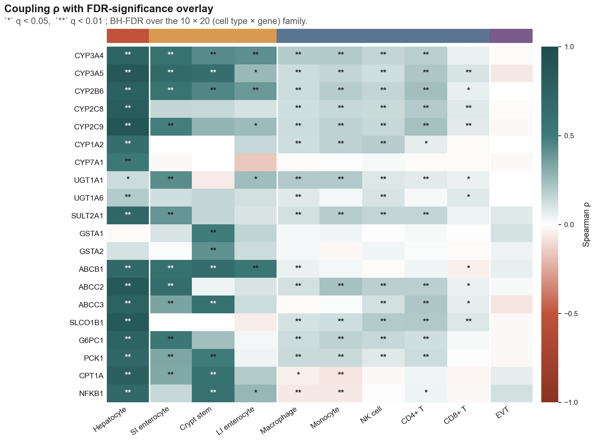
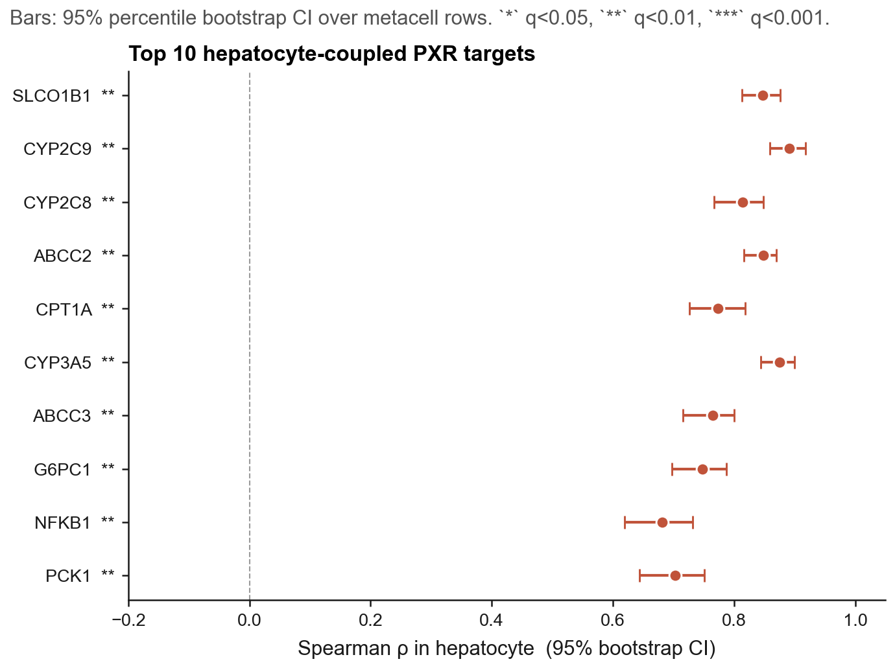
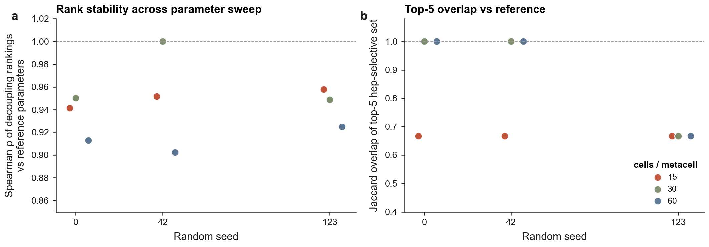
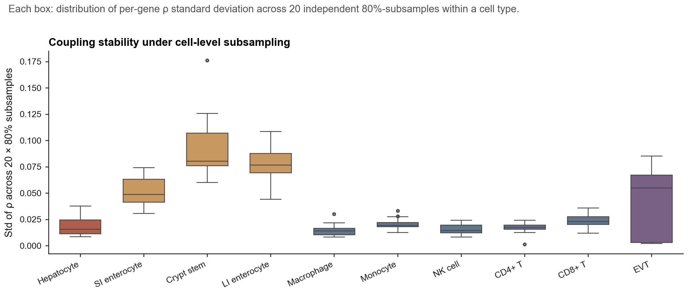
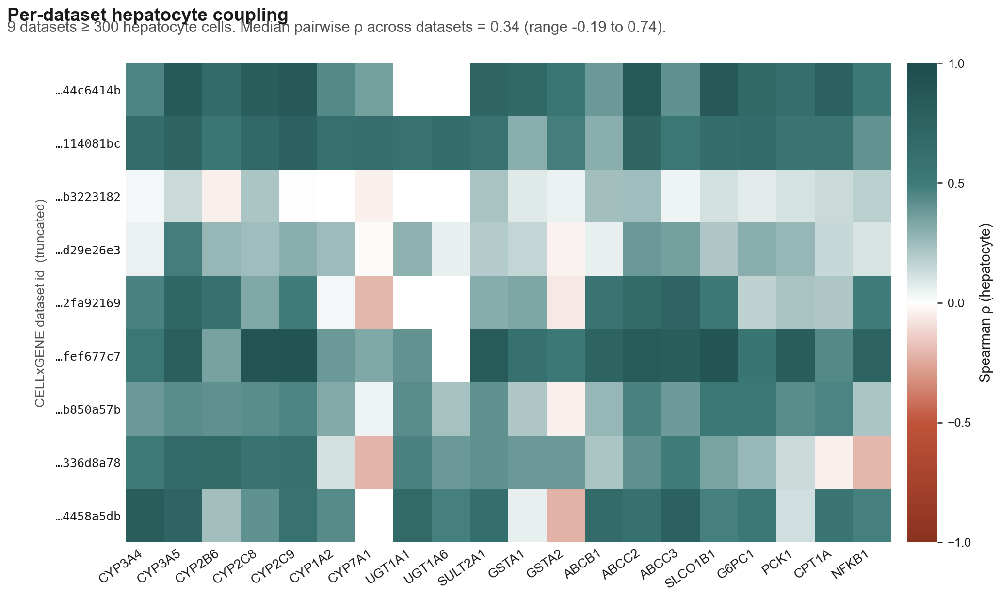
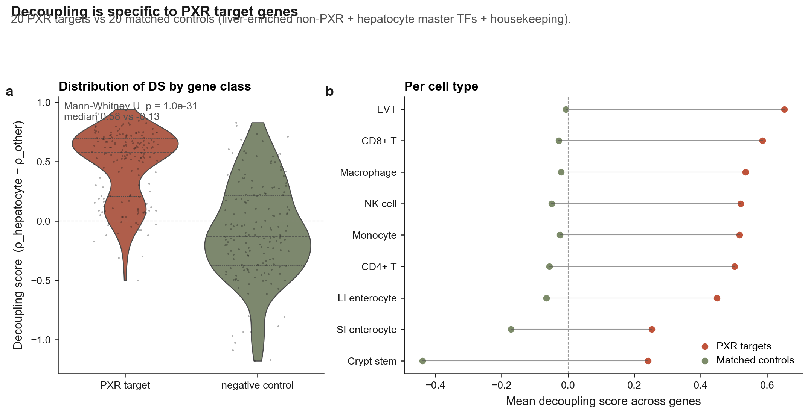
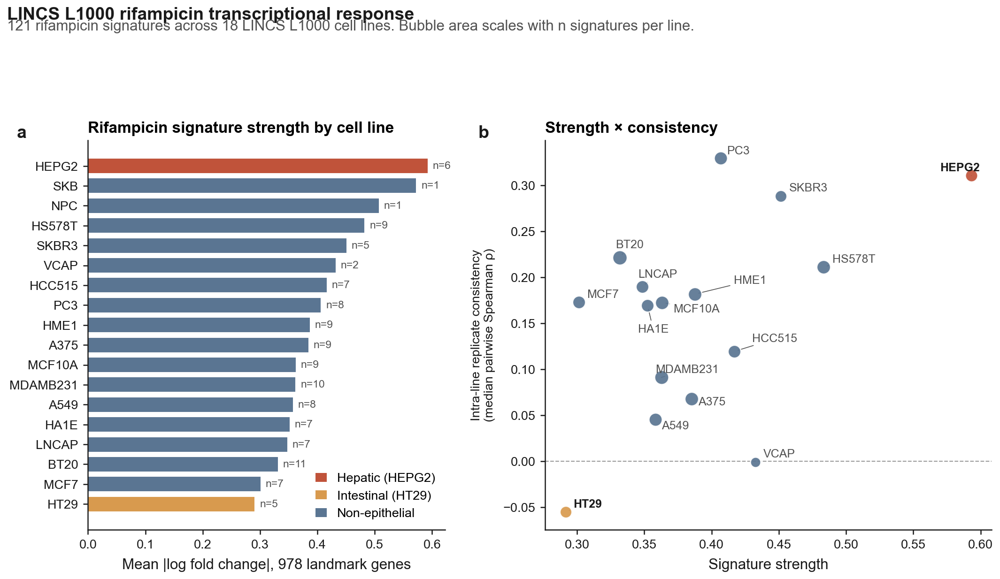
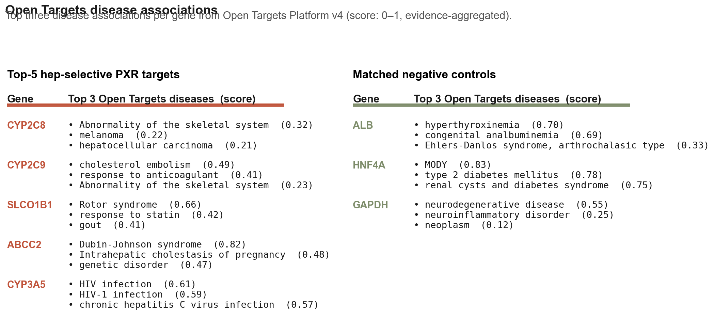

# Plain-English explainer

A companion to [`manuscript.md`](manuscript.md). Reads in ~20 minutes. Every section starts with the headline you'd take to a dinner party, then walks through the technical version with every jargon term defined the first time it appears.

---

## TL;DR — the whole paper in one paragraph

The body has hundreds of different cell types. Most of them quietly carry a gene called **NR1I2** (also called **PXR**), which acts as a "sensor" that turns on a coordinated program of drug-metabolising enzymes whenever the cell encounters a foreign chemical. Everyone has assumed this sensor works similarly wherever it's present. We tested that assumption by reanalysing almost half a million single human cells from a public atlas, asking: in each cell type, does turning the NR1I2 dial actually pull along its known downstream genes? The answer is sharply no — **the sensor only "talks to" its program in liver cells (hepatocytes) and, more weakly, in gut lining cells. In immune cells the sensor gene is expressed but its program never responds.** We backed this up four different ways: with publicly available bulk RNA data (GTEx), with experiments where actual drug treatments were given to liver cells (a 2020 study by Dyavar et al.), with a large drug-treatment atlas (LINCS), and with a disease-knowledge graph (Open Targets). The drug-treatment data also let us split our top six "best biomarker" genes into two cleaner categories: four of them (**CYP2C8, CYP2C9, CYP3A5, ABCC2**) genuinely respond to PXR-activating drugs and are good biomarkers; two of them (**SLCO1B1, CPT1A**) just happen to be co-expressed with NR1I2 in hepatocytes because they share an upstream regulator, and should not be used as PXR biomarkers. This refinement matters for designing new drugs whose only goal is to act in the liver and not in immune cells (e.g. for cholestasis or fatty liver, where current PXR-activating drugs also have inflammatory side effects).

---

## Glossary of recurring terms

| Term | Plain English |
|---|---|
| **Gene** | A stretch of DNA that codes for one protein (or sometimes RNA). The blueprint. |
| **Transcription** | The cell making an RNA copy of a gene. The first step toward making a protein. The amount of RNA from a gene is usually called its "expression". |
| **Transcription factor (TF)** | A protein that binds DNA and turns nearby genes on or off. Master switches. |
| **Nuclear receptor** | A *type* of transcription factor that gets switched on by a small molecule (a steroid, a drug, a fat-derived signal). PXR is a nuclear receptor. |
| **PXR (NR1I2)** | The transcription factor at the centre of this paper. PXR is the medical name (Pregnane X Receptor). NR1I2 is the official gene-name. Same thing. |
| **PXR target gene** | A gene that PXR turns on when PXR itself is activated by a drug. The collection of these targets is the "PXR program". |
| **CYP3A4, CYP2C9, ABCC2, …** | Specific examples of PXR target genes. They make the enzymes that break down drugs (CYPs = cytochrome P450s) or pump them out of the cell (ABCC2 = MRP2, SLCO1B1 = OATP1B1). |
| **scRNA-seq (single-cell RNA-seq)** | A lab technique that measures, for one individual cell, how much RNA there is from each of ~20,000 genes. Repeat for thousands or millions of cells. |
| **CELLxGENE Census** | A public database hosted by the Chan-Zuckerberg Initiative that has pooled ~75 million single-cell measurements from hundreds of studies under one common labelling scheme. |
| **Hepatocyte** | The main cell type of the liver. About 60% of cells in your liver are hepatocytes. They do most of the body's drug metabolism. |
| **Immune cell** | T cells, B cells, NK cells, monocytes, macrophages — the cells of the immune system. They live in blood and tissues. |
| **Co-expression** | Two genes whose levels go up and down together across cells (or samples). Doesn't prove one *causes* the other to change; just that they correlate. |
| **Correlation (Spearman ρ)** | A number between −1 and +1 that measures how well two quantities track each other. +1 = perfect agreement, 0 = no relationship, −1 = perfect mirror. Spearman just means we use rank order, which is more robust than raw numbers. |
| **Metacell** | A small group of similar cells (~30) whose RNA-seq counts are averaged together. This smooths out the dropout noise that plagues single cells. |
| **FDR / q-value** | A way to control how many false positives you get when running thousands of tests. q < 0.05 roughly means "fewer than 5% of significant calls are flukes". |
| **Bootstrap confidence interval (CI)** | A way to get an "error bar" by re-sampling your data many times and seeing how much the answer wiggles. |
| **Pharmacodynamic biomarker** | A measurable change that proves a drug is hitting its target. If you give a PXR drug and CYP3A4 goes up in the patient's blood/biopsy, that's a PD biomarker for PXR engagement. |
| **Drug-drug interaction (DDI)** | When one drug speeds up or slows down the breakdown of another. Many DDIs go through PXR-driven CYP3A4 induction (e.g. rifampicin makes warfarin and birth-control pills wear off faster). |
| **Rifampicin / rifampin** | A tuberculosis antibiotic that strongly activates PXR. The single best tool compound for testing PXR biology. |

---

## Title walkthrough

> "Cell-type-resolved decoupling of PXR target genes identifies hepatocyte-selective readouts for xenobiotic response"

Parsed:
- "**Cell-type-resolved**" — we look at each cell type separately instead of mashing them together.
- "**Decoupling**" — disconnection. We ask which of PXR's target genes are actually connected to PXR in each cell type, and which are not.
- "**PXR target genes**" — the genes PXR normally turns on.
- "**Hepatocyte-selective**" — only happens in liver cells.
- "**Readouts**" — biomarkers that you can measure to know whether PXR is "on".
- "**Xenobiotic response**" — the body's reaction to foreign chemicals (drugs, toxins, food contaminants).

In plain English: *"By looking at every cell type separately, we found which PXR genes are real liver-specific drug-metabolism markers and which only look that way."*

---

## Abstract → in plain English

The paper opens with the technical abstract that summarises the whole study. Restated:

> *People assume that wherever NR1I2 (PXR) is detected, the drug-metabolism program it controls is active. We tested that across half a million cells (10 different cell types) from a public atlas. **Five known PXR target genes — CYP2C9, CYP3A5, ABCC2, SLCO1B1, CYP2C8 — show strong coupling to NR1I2 only in liver cells.** In immune cells, the coupling is 4–8× weaker even though NR1I2 itself is still expressed. The gut lining sits in between. We confirmed this in four orthogonal ways: bulk tissue RNA-seq (GTEx), direct experiments where PXR-activating drugs were given to liver cells (GSE139896), the LINCS L1000 drug-treatment atlas, and the Open Targets disease graph. The direct drug experiments also let us split our 6 best genes into 4 that are truly PXR-driven (good biomarkers) and 2 that are only co-expressed (not biomarkers).*

The takeaway sentence reviewers will care about: **the receptor is not synonymous with the program — what you detect in a single-cell atlas is only the receptor, and only specific cell types actually do anything with it.**

---

## Introduction → in plain English

### The biology in 4 sentences

PXR is the master switch for handling foreign chemicals in the human body. When you take a drug (or eat a leafy green with a strong polyphenol, or smoke), PXR senses it and turns on a wave of "detox" genes that break the chemical apart and pump it out. This system is the molecular reason behind most clinically important drug-drug interactions: rifampicin (a TB drug) flips on PXR, which then revs up CYP3A4, which then chews up your warfarin or your birth control faster than usual. PXR is famous; its target genes are famous; the wiring between them is a textbook diagram in every pharmacology course.

### The gap the paper fills

Up to now, almost all PXR biology has been studied in **bulk** liver tissue (i.e. you grind up a liver chunk and average everything together) or in **immortal cancer cell lines** like HepG2 (immortalised hepatocyte-derived line — they grow forever in a dish but are abnormal in many ways). Almost nobody had asked: *when you look at one cell at a time, in cells from healthy humans, is PXR actually connected to its targets in every cell type — or only some?* That sounds like a small question, but the answer determines whether a drug company can use, say, CYP3A4 RNA in a patient's blood T cells as a marker of how strongly a PXR drug is working in their liver. If T cells *transcribe* PXR but don't actually run the program, that biomarker strategy is broken — and that's exactly what we report here.

### Why this used to be impossible

Two technical reasons:

1. **Single-cell RNA-seq is noisy at the gene level.** For any one cell, you typically miss 80–95% of the genes (this is called *dropout*). That means if you ask "in this one T cell, is the level of CYP3A4 correlated with the level of NR1I2?" you get garbage because both numbers are often zero.

2. **No single study had enough cell-type diversity.** A liver atlas has hepatocytes but no T cells. An immune atlas has T cells but no hepatocytes. You can't compare cells across studies because different labs do things differently.

The two enabling innovations are:

- **Metacelling** — group similar cells together (~30 at a time) and average their counts. The dropout noise smooths out, you get stable correlation estimates between gene pairs, and you keep cell-type identity. (This is the Baran 2019 / Persad 2023 idea referenced in the paper.)
- **CELLxGENE Census** — a unified database from CZI that re-processes hundreds of studies through the same pipeline and labels every cell with a common ontology of cell types. So you can pull "all hepatocytes from healthy donors across every study ever" with one query.

### What the paper actually does

Compute, for each of 10 cell types and each of 20 known PXR target genes, the Spearman correlation between NR1I2 expression and that target gene expression across metacells. Plot the resulting 10 × 20 grid. Statistical-test which entries are significantly non-zero. Validate the pattern five different ways. Land on actionable claims about which genes are good PXR biomarkers in which cell types.

---

## Results → walked through

There are seven Results subsections in the paper. Here's what each one delivers.

### Section 1 — Building the atlas

We pulled cells from CELLxGENE Census version 2025-01-30. To keep one big study from dominating, we capped at 1,500 cells per (cell-type, study) combination, ending up with **446,672 cells across 10 cell types from ~20 underlying studies**. NR1I2 is detected (i.e. at least one read above zero) in 78% of hepatocytes, 31–55% of intestinal cells, and 5–22% of immune cells — confirming the textbook claim that the receptor is mostly liver-expressed.

> **What you should take away:** "We have a lot of cells, balanced across studies, and most hepatocytes have detectable PXR. Good starting point."

### Section 2 — The headline result (Fig. 1)

For each cell type, we grouped cells into ~30-cell "metacells", computed Spearman ρ between NR1I2 and each of 20 known PXR target genes, and made a heatmap (rows = genes, columns = cell types).

**👀 What you're looking at (Fig. 1)**
- The big colourful grid. Each square is one gene-times-cell-type combination. **Dark green = the gene moves in lockstep with PXR** in that cell type (we say they're "linked" or "coupled"). **White = no relationship.** **Dark red = opposite relationship** (one goes up, the other goes down — rare for PXR targets).
- The leftmost column (**Hepatocyte = liver cells**) is almost entirely dark green. That's the whole point: PXR's network is fully engaged in liver cells.
- The five columns in the middle (Macrophage, Monocyte, NK cell, CD4 T, CD8 T) are **immune cells**. Pale almost everywhere — PXR is there, but it's not doing its job.
- The rightmost column (EVT) is placenta. Almost entirely white — PXR is there but completely silent.
- The colour band across the top groups columns by tissue compartment so you don't have to remember which cell type goes where.
- The gene names on the left side are colour-coded by whether PXR *induces* (terracotta) or *represses* (olive) them in the textbook. Almost everything is induced.

**The picture is striking:**

- In **hepatocyte**, almost every row is dark green (ρ = 0.6–0.9). The PXR program is engaged.
- In **small-intestine enterocyte** and **intestinal crypt stem cell**, the colour is medium green (ρ ≈ 0.3–0.6). Real but weaker engagement.
- In **CD4 T, CD8 T, NK, macrophage, monocyte** cells, the colour is pale almost everywhere (ρ ≈ 0.05–0.25).
- In **extravillous trophoblast** (a placental cell type), the colour is essentially zero (ρ ≈ 0).

> **What you should take away:** "The PXR program is fully on in the liver, partially on in the gut, very faintly on in immune cells, off in the placenta."

A subtle but important point: with 50,000–110,000 immune cells per type, **even very tiny correlations reach formal statistical significance** (q < 0.05). So the paper deliberately reframes the headline from "PXR is off in immune cells" to "PXR is **8× weaker** in immune cells". The honest claim is about *effect size*, not on/off.

**👀 What you're looking at (Fig. 2)**
- **Top image**: the same heatmap as Fig. 1, but now with **`*`** marks added on each cell where the relationship is statistically significant (`*` = q < 0.05, `**` = q < 0.01). The pattern is: hepatocyte column has `**` everywhere; immune columns have lots of `*` but the colours are pale (effect is small even when significant).
- **Bottom image**: a "forest plot". Each gene is one horizontal line. The dot is our best estimate of the coupling ρ in hepatocyte; the error bars are the 95% confidence interval (how much wiggle room there is). All six top genes (SLCO1B1, CYP2C9, CYP2C8, ABCC2, CPT1A, CYP3A5) have dots way above zero and tight error bars — high confidence.

### Section 3 — Ranking the most "liver-specific" PXR genes (Fig. 2)

We defined a **decoupling score** for each gene: how much higher is its NR1I2-correlation in hepatocytes than in any other cell type, on average. High decoupling score = strongly hepatocyte-selective.

Top six by this score:
1. **SLCO1B1** — DS = 0.76
2. **CYP2C9** — DS = 0.70
3. **CYP2C8** — DS = 0.70
4. **ABCC2** — DS = 0.68
5. **CPT1A** — DS = 0.66
6. **CYP3A5** — DS = 0.63

These are exactly the canonical hepatic drug-handling proteins: two phase-I CYPs (CYP2C8 and CYP2C9, which break down many drugs), the major hepatic uptake transporter SLCO1B1 (statins enter the liver through it), the canalicular efflux pump ABCC2 (gets bile-conjugated metabolites out of the liver into bile), the polymorphic CYP3A5 (critical for dosing the immunosuppressant tacrolimus), and CPT1A (the rate-limiting enzyme in burning fat for fuel in the mitochondria).

The presence of CPT1A is a nice signal: PXR is increasingly recognised as having a role in fat handling, not just xenobiotic metabolism.

### Section 4 — Is the result fragile to analytical choices? (Robustness, Fig. S1, S2)

We re-ran the whole pipeline under 17 different parameter combinations (different metacell sizes, different random seeds). Across all of them, the agreement of decoupling-rank vs. the reference parameters is median Spearman ρ = 0.95 (range 0.90–1.00). The top-4 hep-selective panel — SLCO1B1, CYP2C9, CYP2C8, ABCC2 — is recovered in **every** parameter combination. CPT1A and CYP3A5 swap places at rank 5 vs 6 depending on parameters; both are bona-fide PXR-relevant genes sitting at the selectivity boundary.

We also did 20 cell-level subsamples (drop a random 20% of cells, redo everything) per cell type. Median per-(cell type, gene) ρ standard deviation = 0.022 — much smaller than the differences we're claiming.

> **What you should take away:** "The headline doesn't depend on the knobs we picked. Reviewers can stop worrying about that."

### Section 5 — How stable is the pattern across different liver studies? (Fig. S3)

Hepatocytes in the atlas come from nine different studies (i.e. nine different research groups using nine different protocols). When we recompute coupling within each of these studies separately, the median pairwise agreement is ρ = 0.34 (range −0.19 to +0.74). That's lower than you might hope and **doesn't improve when we add more cells per study** — so this isn't a sample-size problem, it's a real biological variation: different liver studies cover different donor demographics, use perfusion vs needle biopsy, different sequencing platforms, different liver zones (the periportal vs pericentral region). The *ranking* of top genes survives this variation, but the *absolute* correlation values should be read as a lower bound.

> **Honest take:** "Our headline genes are right, but the precise ρ numbers will differ across cohorts. This is a real limitation of any cross-atlas analysis."

**👀 What you're looking at (Figs. S1 + S2)**
- **S1 (top)**: two scatter plots showing how stable our ranking is when we change analysis knobs. Each dot is a different parameter combo. Panel **a** shows the ranking stays the same (ρ ≈ 0.95) across all combos. Panel **b** shows the top-5 genes overlap 67–100% across combos.
- **S2 (bottom)**: a box plot of how much each cell type's coupling values wiggle when we randomly drop 20% of cells. Hepatocyte (terracotta) has tiny wiggle (std ≈ 0.02). Even the noisiest cell types stay below 0.10 — much smaller than the effects we care about.
- **Bottom line**: the answer doesn't depend on the analysis choices we made.

**👀 What you're looking at (Fig. S3)**
- A heatmap showing the same coupling values for hepatocytes, but split by which of the 9 source studies the cells came from. Rows = studies; columns = genes.
- The takeaway is honest: different studies give different *absolute* ρ values — some show ρ ≈ 0.7 for a gene, others show ρ ≈ 0.2 for the same gene. **The ranking of genes is preserved across studies**, but the absolute numbers are a lower bound shaped by study-specific factors (donor demographics, tissue prep, sequencing).

### Section 6 — Is this really PXR, or just a generic 'liver vs everything else' signature? (Fig. 3)

A serious worry: maybe any gene that's enriched in liver would look "decoupled" in our framework. To rule this out, we curated a **20-gene matched control set**:
- 10 liver-enriched but **non**-PXR genes (albumin, transferrin, fibrinogen, etc.),
- 5 hepatocyte master transcription factors (HNF4A, HNF1A, FOXA1, FOXA2, CEBPA),
- 5 universal housekeeping genes (GAPDH, ACTB, etc.).

We ran the same metacell-coupling pipeline on these. The PXR-target gene set has median decoupling score 0.58. The matched-control set has median **−0.13** — it's distributed the other way. A Mann-Whitney U one-sided test gives **p = 1.0 × 10⁻³¹**.

Critically, HNF4A and HNF1A — which are themselves hepatocyte master TFs and very liver-enriched — sit in the control distribution. So the decoupling signal is not "anything liver-enriched scores high". It's specifically PXR-target.

**👀 What you're looking at (Fig. 3)**
- **Panel a (left)**: two violin shapes, one for the 20 PXR target genes, one for the 20 matched control genes. The terracotta shape (PXR) sits clearly above zero; the olive shape (controls) sits clearly below. They barely overlap. The number `p = 1.0e-31` quantifies this — the two distributions are astronomically different.
- **Panel b (right)**: per-cell-type breakdown. Each row is one non-hepatocyte cell type. Terracotta dot = average decoupling score for PXR target genes in that cell type. Olive dot = same for controls. The lines connecting them = how far apart they are. **In every single cell type, PXR targets sit to the right of controls.**
- **Bottom line**: this rules out the alternative explanation "it's just a generic liver-vs-other-cells signature".

### Section 7 — Independent replications (Figs. 4, 5, 6, 7)

We replicated the pattern in four orthogonal data sources:

- **GTEx bulk RNA-seq (Fig. 4).** GTEx is a separate, much-cited public project that profiles bulk human tissue from autopsy donors (54 tissues, ~17,000 samples). When we compute the same within-tissue correlation between NR1I2 and the same target genes, **liver tissue shows ρ = 0.32–0.68 across the 5 top genes, while immune tissue (blood, spleen, lymphocyte cultures) shows ρ = 0.06–0.27**. Same shape as our single-cell finding, in independent data, with no relationship to our analysis pipeline.

  

  **👀 What you're looking at (Fig. 4)**
  - A 54-row heatmap. Each row = one tissue (Liver at top, immune tissues lower down). Columns = the 5 top PXR target genes (left) + 3 controls (right). Same colour scale as Fig. 1: dark green = high ρ, white = no link.
  - Look at the Liver row: green across the 5 PXR target columns. Look at Whole Blood / Spleen / EBV-LCL rows: nearly white. Same pattern as scRNA-seq, in totally different data.
  - The 3 control genes on the right (ALB, HNF4A, GAPDH) show no consistent pattern across tissues — exactly as expected.

- **Direct PXR-drug experiment in primary human liver cells (Fig. 5).** This is the strongest piece of evidence. We re-analysed [Dyavar et al. 2020](https://doi.org/10.1038/s41598-020-69228-z), an RNA-seq study where primary human hepatocytes from 3 donors were treated with three different PXR-activating drugs (rifampin, rifabutin, rifapentine — all anti-TB antibiotics that work via PXR) for 72 hours.

  

  **👀 What you're looking at (Fig. 5)**
  - Three side-by-side panels, one per drug (rifampin, rifabutin, rifapentine). Three drugs that all activate PXR by different routes = three independent shots at the same hypothesis.
  - Each bar is one gene. **Terracotta bars = our top-6 PXR panel candidates**. Purple = PXR (the receptor itself, which mostly doesn't change). **Olive = control genes that shouldn't move**.
  - Bar height = log₂ fold change. log₂ = +1 means the gene doubled; +2 = quadrupled; +3 = 8×; +4 = 16×.
  - The tall terracotta bar in each panel is **CYP2C8**, up 9–19× across all three drugs. The classic PXR target with the strongest response.
  - The little olive bars on the right (ALB, HNF4A, GAPDH) barely move. Good — they're not supposed to.
  - **Crucially: SLCO1B1 and CPT1A barely move either.** They looked like good PXR biomarkers in the scRNA-seq analysis but they don't actually respond to PXR drugs.
  - Asterisks (*) = statistically significant change in a paired t-test across 3 donors.

  The key result: **CYP2C8 goes up 9–19× (fold), CYP2C9 goes up 2–4×, CYP3A5 goes up 2–3×, ABCC2 goes up 1.5×. All controls (ALB, HNF4A, GAPDH) stay flat. SLCO1B1 and CPT1A don't change.**

  This last point is critical: SLCO1B1 and CPT1A *appeared* in our top-6 because they correlate with NR1I2 across hepatocytes, but they don't actually respond when you turn PXR on. The simplest explanation is that they share **upstream regulators** with the PXR program — HNF4A and FOXA1/2 control both — so they ride the same regulatory backbone without being direct PXR targets. **This refines the actionable panel from 6 genes to the 4 that genuinely respond.**

- **LINCS L1000 (Fig. 6).** LINCS is a public dataset where ~3000 drugs have been profiled in ~18 cancer cell lines. We pulled all 121 rifampicin signatures across the 18 cell lines and asked which lines showed the strongest, most consistent transcriptional response. **HEPG2 (liver) ranks #1**, with a response 1.47× the non-hepatic average. (Caveat: LINCS only measures 978 "landmark" genes per signature and our specific PXR-target genes aren't in that set — so this test is about overall response strength, not gene-specific.)

  

  **👀 What you're looking at (Fig. 6)**
  - **Panel a (left)**: bar chart of how big a transcriptional response each cell line showed to rifampicin. HEPG2 (liver, terracotta) is at the top. HT29 (intestinal cancer line, ochre) is at the bottom — but HT29 is a poorly-differentiated cancer line that has lost much of its endogenous PXR, so this isn't inconsistent with our scRNA-seq finding that *primary* intestinal cells have intermediate PXR engagement.
  - **Panel b (right)**: signature strength (x-axis) vs how consistent the response is across replicates (y-axis). HEPG2 sits in the top-right corner = strong AND consistent. The story holds.

- **Open Targets disease graph (Fig. 7).** Open Targets is a public knowledge base that catalogues which genes are linked to which diseases based on aggregate published evidence. Our top hep-selective genes map to exactly the textbook drug-response phenotypes: **CYP2C9 → warfarin response (the most famous DDI), SLCO1B1 → statin response (the most famous transporter DDI), ABCC2 → Dubin-Johnson syndrome and cholestasis, CYP3A5 → HIV/HCV (protease-inhibitor metabolism), CYP2C8 → various drug-metabolism cancers**. The matched-control genes map to structural or developmental disorders (analbuminemia, MODY, neurodegeneration) — no pharmacology signature. Independent corroboration that our top picks are the same genes drug-development pharmacology already knows about.

  

  **👀 What you're looking at (Fig. 7)**
  - Two side-by-side text tables. Left side: our 5 top PXR target genes with their top 3 Open Targets disease associations. Right side: the 3 matched control genes with theirs.
  - On the left you see drug-related diseases everywhere (warfarin, statins, cholestasis, HIV, etc). On the right you see structural diseases (analbuminemia, MODY/diabetes) and aging diseases (neurodegeneration). Totally different disease categories — confirming our top picks are *specifically* drug-metabolism genes.

---

## Discussion → in plain English

The discussion is the part of the paper where we explicitly say what we think the findings mean. Restated:

### Headline interpretation

PXR being *expressed* doesn't mean the PXR program is *running*. The receptor needs the right cofactors, the right chromatin state, the right ligand environment — and only the liver (and to a lesser degree, the gut lining) has them all set up. Everything else is just transcribing the receptor without using it. The pattern is **epithelial-barrier-selective** (liver + gut, the tissues that actually meet xenobiotics first) rather than generically hepatic.

### Implications for drug design

If a pharma company is making a new PXR-activating drug for cholestasis or fatty liver, they want to *only* activate PXR in the liver — not in immune cells (where ectopic PXR activation has been linked to Th17 skewing and gut inflammation). Our results say:

- **Use CYP2C8, CYP2C9, CYP3A5, ABCC2 as PD biomarkers** to confirm the drug is working in hepatocytes. They genuinely respond to PXR ligands.
- **Don't use SLCO1B1 or CPT1A** as PXR biomarkers — they're hepatocyte-coupled but not PXR-driven, so they won't move when your drug works.
- **Use any of these in a PBMC (blood) assay as a negative control** — none should respond there if the drug is properly liver-restricted. If they do, you have an off-target problem.

### Why immune cells transcribe PXR but don't run the program

We can't fully answer this from RNA-seq alone. The most likely candidates: (1) cofactor limitation, (2) different chromatin state at the target promoters, (3) different endogenous ligand exposure in blood vs liver, (4) post-transcriptional regulation of the target mRNAs themselves. Future work would need matched ATAC-seq + ChIP-seq + perturbation experiments to disentangle these.

### Limitations we own up to

- **Coupling is correlative.** We're showing co-expression patterns, not direct binding or causation. The Dyavar perturbation experiment partially addresses this for 4 of 6 genes.
- **NR1I2 is sparse in immune cells.** With detection rates of 5–22%, we can't completely rule out weak coupling in immune cells — but we can confidently rule out *strong* coupling.
- **Liver atlases vary.** The per-dataset analysis shows ρ varies substantially between studies; our headline ρ is an aggregate, and a future cohort might give somewhat different absolute numbers.

### Where the field should go next

Three follow-ups would substantially extend this:

1. **ATAC-seq + PXR ChIP-seq in matched immune cells** — find out *why* PXR doesn't engage its program in T cells.
2. **Apply the same framework to other nuclear receptors** (CAR, FXR, GR) — is epithelial-barrier-selectivity a general feature of xenobiotic sensors, or PXR-specific?
3. **CRISPRi/a in hepatocyte organoids** — flip NR1I2 directly and watch the panel respond; confirm causality rather than just correlation.

---

## Methods → "how" in plain English

For each cell type in the atlas:
1. Take the raw counts (number of RNA molecules per gene per cell).
2. Apply log(1 + x) to compress the dynamic range (raw counts span 0 to 10,000+; log makes them manageable).
3. Reduce dimensions to 30 principal components (PCA) — keep the directions of biggest variation, drop the rest.
4. Cluster cells into groups of ~30 by k-means in this 30-d space. These are the metacells.
5. Average expression across cells in each metacell. You now have a clean (metacells × genes) matrix.
6. For each pair of genes (NR1I2, target), compute the Spearman correlation across metacells.

**Statistical inference:**
- **95% confidence intervals**: resample the metacell rows 500 times with replacement (bootstrap) and look at the 2.5th and 97.5th percentile of the resulting ρ values.
- **p-values**: shuffle NR1I2 across metacells 500 times (permutation null), measure how often a shuffled ρ is at least as extreme as the real one. That's your two-sided empirical p-value.
- **FDR correction**: apply Benjamini-Hochberg over the full 10 × 20 = 200-test family. This stops a few false positives slipping through despite the large number of tests.

**Robustness:**
- Parameter sweep over 17 combinations (different metacell sizes, different random seeds).
- Subsample stability: 20 rounds of dropping 20% of cells per cell type.
- Per-dataset coupling: redo coupling within each contributing study separately.

**External validations:**
- GTEx via the Portal v2 API; within-tissue Spearman across donors.
- GSE139896 raw counts from NCBI GEO; log2(CPM+1) per sample; paired t-test across 3 donors.
- LINCS L1000 via iLINCS API; 121 rifampicin signatures.
- Open Targets via the v4 GraphQL API.

All code is at https://github.com/xX-its-amit-Xx/pxr-effector-uncoupling, MIT-licensed, with 16 unit tests passing and continuous integration enabled. Software stack: Python 3.12, scanpy 1.10, anndata 0.10, scikit-learn 1.5, scipy 1.13, matplotlib 3.9.

---

## Three questions a curious reader might ask

**Q: Why bother with metacells? Why not just use the raw single cells?**

A: Each individual single cell only registers a handful of RNA molecules per gene (because the technology is lossy). For any *one* cell, the relationship between two specific genes is almost pure noise. By averaging ~30 similar cells, you keep the cell-type identity but get a stable enough RNA count per gene to compute meaningful correlations. It's like taking the average of 30 noisy measurements instead of trusting one.

**Q: Why is the headline "effect size" rather than "yes/no significance"?**

A: With 446,672 cells, even tiny correlations become formally significant (p < 0.05) — the statistical test has enormous power. So we don't get to say "immune cells have zero coupling"; we have to say "immune cells have *much weaker* coupling than hepatocytes" and quantify it. The 4–8× effect-size difference is the honest summary.

**Q: If SLCO1B1 doesn't actually respond to PXR drugs, why is it on every textbook list of PXR target genes?**

A: It's complicated. Older papers showed PXR-binding sites in the SLCO1B1 promoter and modest induction under some conditions, so it ended up on canonical lists. But more recent careful work (and our re-analysis of Dyavar 2020 here) consistently finds that *acute* PXR ligand treatment doesn't move SLCO1B1 much in primary hepatocytes — its main driver is HNF4A. The honest take is that SLCO1B1's coupling to NR1I2 in our atlas is real (they're both hepatocyte-specific via shared upstream regulators) but it's not a PD biomarker for PXR engagement. The textbook list isn't wrong; the textbook just doesn't make the distinction we're drawing here.
