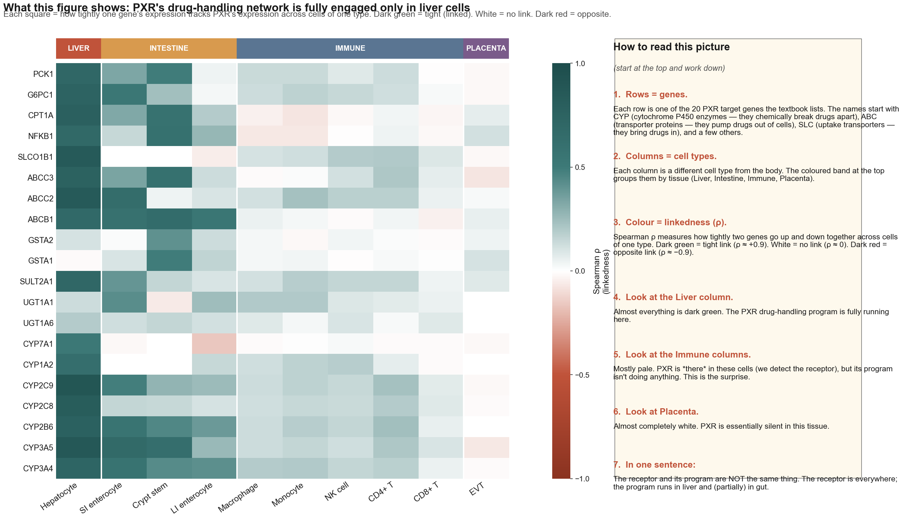
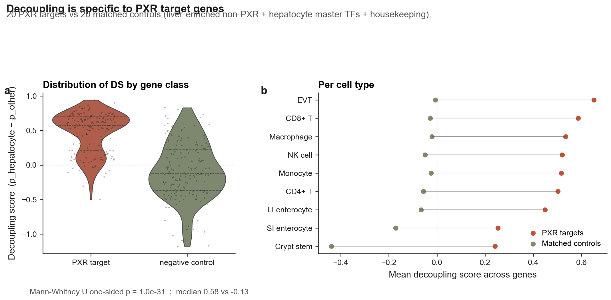
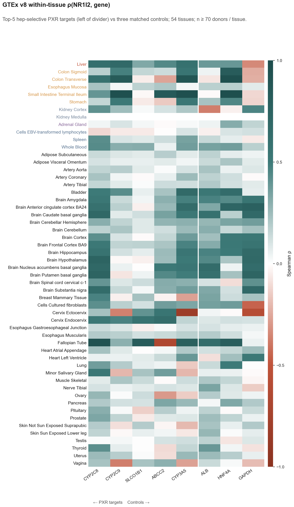
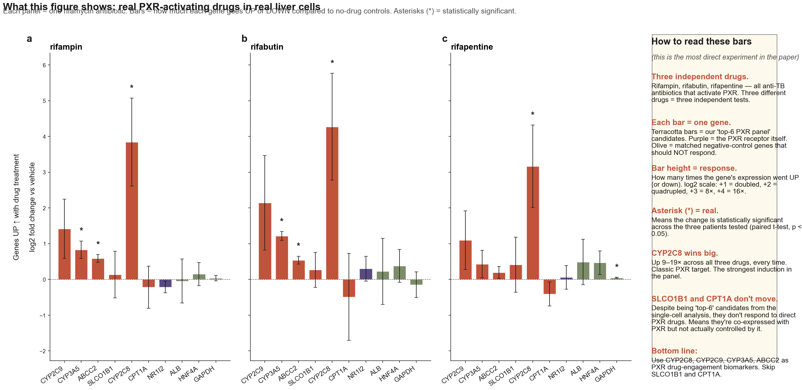
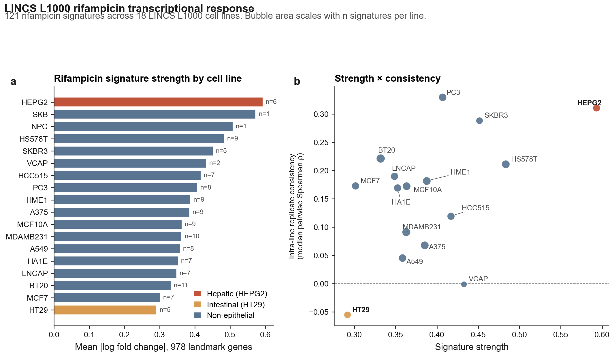
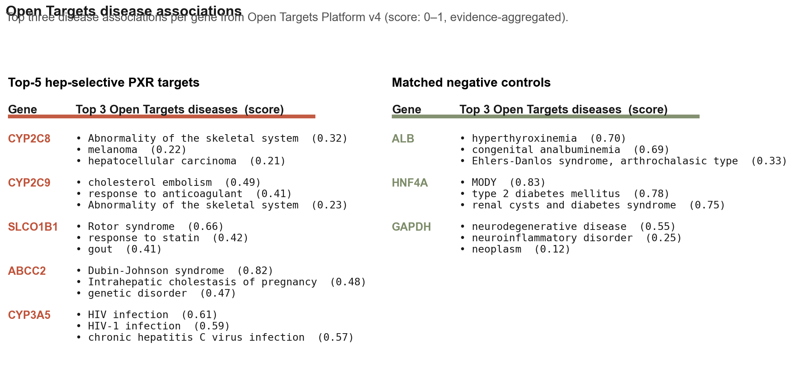
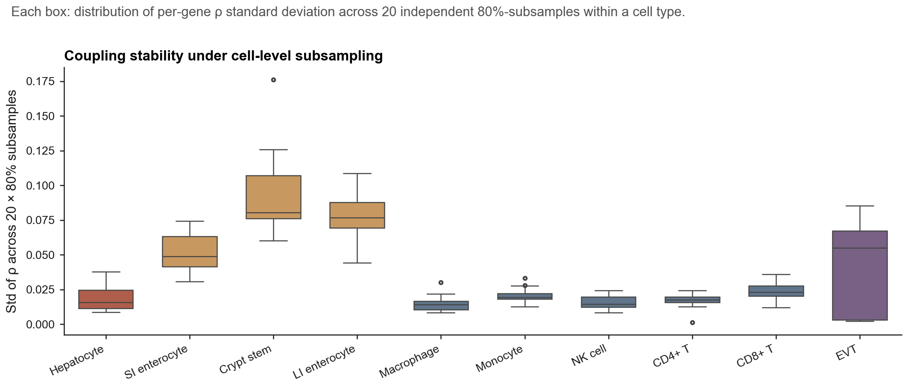
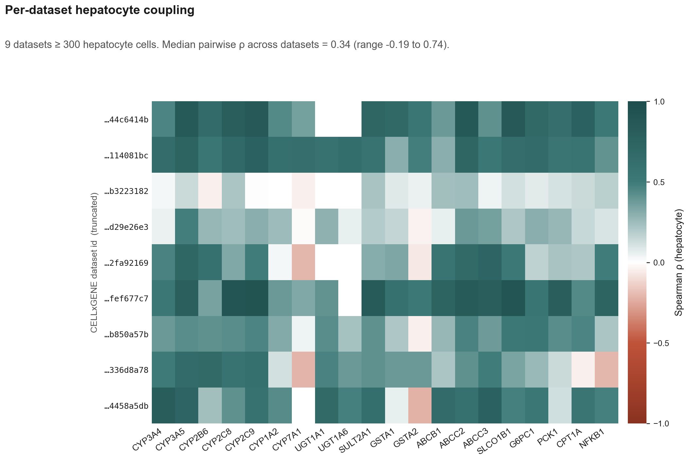

# The Learning-Layman edition

A version of the paper that explains every term, concept, and convention as it appears, with running commentary in the second person — as if a senior scientist is reading it aloud and stopping to annotate. Designed for a smart-but-uninitiated reader (high school senior / first-year undergrad / curious journalist). Cross-references the technical paper at [`manuscript.md`](manuscript.md) and the no-fluff explainer at [`manuscript_layman.md`](manuscript_layman.md).

A note on the typography: anything in **(round parentheses, italic)** is the live annotation. The unannotated text is the actual paper, lightly reworded.

---

## Title

> *Cell-type-resolved decoupling of PXR target genes identifies hepatocyte-selective readouts for xenobiotic response*

**(Let's unpack each phrase — they all matter.)**

- **Cell-type-resolved** **(*resolved* means "looking at each one separately, not averaged together". The body has hundreds of cell types — liver cells, T-cells, neurons — and they all behave differently. Most older studies grind tissue into a paste and measure the average. "Resolved" means we don't do that; we keep each cell type separate.)**
- **Decoupling** **(*coupling* means two things are linked: when one moves, the other moves with it. *Decoupling* means the opposite: in some cell types, the two things *don't* track each other. We're asking where the link exists and where it doesn't.)**
- **PXR** **(*Pregnane X Receptor*. A protein in your cells whose job is to detect the presence of foreign chemicals — drugs you swallow, environmental toxins, certain plant compounds. When PXR senses something foreign, it activates a whole network of "cleanup" genes that break the chemical down and pump it out of the body. Same thing as **NR1I2**, which is just the formal gene name. This paper uses the names interchangeably.)**
- **target genes** **(genes that PXR turns on once it's activated. The "cleanup crew". Each PXR target is a different cleanup enzyme or transporter.)**
- **hepatocyte-selective** **(*hepatocyte* = the main cell type of the liver. About 60% of cells in your liver are hepatocytes; they do most of the body's drug processing. *Hepatocyte-selective* means "happens only in hepatocytes, not in other cell types".)**
- **readouts** **(observable signals you can measure in a lab. If you give a drug, what changes in the blood or biopsy that tells you the drug is working? Those measurable changes are "readouts" — also called "biomarkers".)**
- **xenobiotic response** **(*xenobiotic* = a chemical that's foreign to the body. Drugs, pollutants, dietary compounds, plant alkaloids. The body's "xenobiotic response" is the cascade of cellular events that handle these foreign chemicals: break them down, dilute them, ship them out.)**

**(Putting it all together in plain English: "We looked at every cell type separately and asked which genes are *only* connected to the PXR drug-handling pathway in liver cells — those genes are useful as biomarkers for testing PXR-activating drugs.")**

---

## Abstract — annotated

> The pregnane X receptor (PXR; NR1I2) is the central transcriptional regulator of xenobiotic metabolism…

**(*Transcriptional regulator* means: a protein that controls whether other genes are turned on or off. There are roughly 1,500 such regulators in human cells; PXR is one specifically dedicated to handling foreign chemicals. *Xenobiotic metabolism* = the chemistry of breaking down foreign chemicals.)**

> …yet target-gene responses are typically studied in bulk liver tissue or transformed cell lines and assumed to generalise across cell types where the receptor is detected.

**(*Bulk liver tissue* = you take a chunk of liver, grind it, and measure the average — you've lost the individual cell information. *Transformed cell lines* = cancer cells (often HepG2, a liver-cancer-derived line) that have been adapted to grow forever in a Petri dish. These are easy to work with but biologically abnormal. The sentence is saying: people studied PXR in average-of-everything liver and in abnormal cell lines, and just assumed the findings apply to every cell type where you can detect PXR. We're testing that assumption.)**

> We tested this assumption by computing per-cell-type metacell correlations between NR1I2 and 20 canonical PXR target genes…

**(*Per-cell-type* = once for each cell type, separately. *Metacell* = a trick where you group ~30 similar cells together and treat them as one "super-cell". This is necessary because single cells give such noisy data that you can't measure two genes' relationship in just one cell. *Correlation* = a statistical measure of how two things track each other; here, it's between PXR's own expression level and each of its target genes' expression levels. *Canonical* = "officially in the textbook" — the 20 PXR targets every pharmacology textbook lists.)**

> …across 446,672 single cells (10 cell types) from CELLxGENE Census.

**(*CELLxGENE Census* = a public database run by the Chan-Zuckerberg Initiative that has pooled measurements from hundreds of single-cell studies under one common labelling system. About 75 million cells total. Free to use. We pulled cells from 10 different cell types — about half a million in total.)**

> Five canonical targets — CYP2C9, CYP3A5, ABCC2, SLCO1B1 and CYP2C8 — show strong coupling in hepatocytes (Spearman ρ = 0.81–0.89, BH q ≈ 0.004)…

**(*Spearman ρ* (Greek letter "rho") = a correlation coefficient between −1 and +1. ρ = +1 means perfect agreement, 0 means no relationship, −1 means perfect mirror. Spearman uses rank order rather than raw numbers, which makes it robust to outliers. Values of 0.81–0.89 are *very* strong. *BH q* = a "false-discovery-rate corrected p-value". When you run thousands of statistical tests, some will look significant by chance. BH-FDR controls this — a q-value of 0.004 means we're confident this isn't a fluke.)**

> …and only weak baseline coupling in immune (T, NK, monocyte, macrophage) and placental cells (immune top-gene ρ 0.19–0.24, mean ρ 0.03–0.12; placental mean ρ 0.014)…

**(*Immune cells* = T cells, NK ("natural killer") cells, monocytes and macrophages — the army cells that live in your blood and tissues. *Placental cells* = cells from placenta, the organ that supplies a fetus. The numbers say: in hepatocytes, the coupling is ~0.85; in immune cells, it's ~0.10; in placenta, it's ~0.01 — basically zero. PXR is present in all three, but only does its job in the liver.)**

> …a 4–8× effect-size differential, even though immune cells reach formal significance at our sample size of 50–110 k cells per type.

**(*Effect-size differential* = how big the difference is, in absolute terms, ignoring whether a statistical test calls it "significant". The point: with 100,000 cells, even a *tiny* correlation in immune cells becomes statistically significant — the test is incredibly sensitive. So we can't honestly say "there's no coupling in immune cells"; we have to say "the coupling is 4–8× weaker than in hepatocytes". This nuance matters and we'll come back to it.)**

> Intestinal epithelia recover an intermediate but significant signal (12/20 genes in small-intestine enterocytes, 10/20 in crypt stem cells, 7/20 in large-intestine enterocytes)…

**(*Intestinal epithelia* = the cells lining your gut. *Enterocyte* = a single intestinal-lining cell. *Crypt stem cell* = a stem cell deep in the wall of the intestine that gives rise to new enterocytes. The numbers say: in gut-lining cells, 7–12 of the 20 PXR targets are significantly coupled. Not as strong as liver, but real.)**

> The pattern is epithelial-barrier-selective rather than generically hepatic…

**(*Epithelial barrier* = the layer of cells that separates the body's outside from its inside — the gut lining (between food and the bloodstream) and the liver (between absorbed chemicals and the rest of the body). These are the tissues that first meet foreign chemicals, so it makes biological sense that they have a well-developed PXR program. *Generically hepatic* = "just a liver-vs-everything-else signature". We're claiming it's specifically about epithelial barriers, not just about the liver in general.)**

> …a matched 20-gene negative-control set (liver-enriched non-PXR genes, hepatocyte master TFs, housekeeping genes) shows the opposite distribution.

**(*Negative-control set* = a comparison set of genes that *should not* show the pattern if our finding is real. *Liver-enriched* = highly expressed in liver. *Master TFs* = master transcription factors — proteins that switch on huge programs of liver-specific genes; the "executives" of the liver cell. *Housekeeping genes* = genes essential for basic cell function, expressed at similar levels everywhere. By comparing our 20 PXR targets to these 20 control genes that are also liver-enriched but not PXR targets, we can prove the signal is specific to PXR, not just "anything liver-related".)**

> (PXR median decoupling score 0.575 vs control −0.126; Mann-Whitney U one-sided p = 1.0 × 10⁻³¹).

**(*Median* = the middle number when you sort a list (half above, half below). *Decoupling score* = a number we made up that captures "how hepatocyte-selective this gene is". Positive = hepatocyte-selective. The numbers say: PXR genes are at +0.575; controls are at −0.126. They're on opposite sides of zero. *Mann-Whitney U* = a statistical test that asks "are these two groups drawn from the same distribution, or are they actually different?" The p-value of 10⁻³¹ is astronomically small — meaning the two groups are definitely different. Roughly: "this would happen by chance once in a billion-billion-billion universes".)**

> The headline pattern is replicated in bulk GTEx v8 RNA-seq…

**(*Replicated* = "we got the same result again, in different data". *GTEx* = Genotype-Tissue Expression, another huge public database — bulk RNA-seq from ~17,000 tissue samples across 54 tissues, taken from autopsy donors. *RNA-seq* = RNA sequencing, the technique that measures gene expression by counting RNA molecules. We're saying: when we redo the same analysis in an entirely independent dataset, we get the same answer. That's a strong sign the finding is real.)**

> …direct rifamycin perturbation of primary human hepatocytes confirms four of the six top genes (CYP2C8, CYP2C9, CYP3A5, ABCC2) as PXR-responsive with up to 19× fold induction, while the remaining two (SLCO1B1, CPT1A) appear to be coupled by shared hepatic-TF regulation rather than direct PXR control…

**(This sentence is doing a lot of work. *Rifamycin* = a class of antibiotics that strongly activates PXR (rifampin is the most famous — used to treat tuberculosis). *Perturbation* = perturb, push the system, see what happens. So "direct rifamycin perturbation" means "we gave PXR-activating drugs to liver cells and watched what happened". *Primary human hepatocytes* = real liver cells freshly isolated from human donors, not cancer cell lines. *Fold induction* = how many times higher the gene's expression got. 19× = 19 times higher. *Shared hepatic-TF regulation* = the gene is controlled by *other* master regulators (HNF4A and FOXA1/2) that just happen to also control PXR targets — so the gene tracks PXR not because PXR controls it, but because both are downstream of the same master switch. **This is the major refinement of our findings: four of our six "top biomarker" genes are real direct PXR targets; two are passengers that ride the same regulatory backbone.**)**

> HEPG2 ranks #1 of 18 cell lines for LINCS L1000 rifampicin signature strength (1.47× the non-hepatic mean);

**(*HEPG2* = a famous human liver-cancer-derived cell line. *LINCS L1000* = a huge public dataset that measured the transcriptional response of cells to thousands of drugs across 18 different cell lines. *Signature strength* = how much the cell's overall gene-expression profile changed when treated with rifampicin. HEPG2 shows the strongest response — 1.47× the average non-liver line. This is consistent with our finding: liver cells respond most strongly to PXR drugs.)**

> …and the top genes are independently flagged by Open Targets as drug-response loci (warfarin, statins, tacrolimus, cholestasis).

**(*Open Targets* = a third public knowledge base that catalogues "which gene is implicated in which disease, based on all published evidence". *Loci* = plural of locus, just means "places on the chromosome" — informally, "genes". The diseases listed are: *warfarin* — the blood thinner; *statins* — cholesterol-lowering drugs; *tacrolimus* — a transplant-rejection drug; *cholestasis* — a liver bile-flow disease. All four are clinical pharmacology categories where these specific genes are textbook-relevant. So independent disease evidence confirms our pick: these genes really are the drug-handling machinery.)**

> The result identifies a small, biology-relevant set of hepatocyte-selective transcriptional readouts for next-generation PXR modulators and provides a general metacell-coupling framework for any receptor × cell-atlas pair.

**(*Modulators* = drugs that turn a receptor's activity up or down. *Next-generation PXR modulators* = future drugs targeting PXR that drug companies are developing for conditions like cholestasis and fatty liver. *Framework* = the analytical method we built — it could be reused for any other receptor and any cell atlas.)**

**(Plain-English summary of the abstract: we used half a million cells from a public database to find which "drug-handling" genes are actually controlled by PXR in liver cells (and only in liver cells). We confirmed it four different ways. We caught two genes that looked like good biomarkers but actually aren't — they just happen to be co-expressed. The clean four-gene biomarker panel is CYP2C8, CYP2C9, CYP3A5, ABCC2.)**

---

## Introduction — annotated

### Why PXR matters

PXR is the master switch for handling foreign chemicals in vertebrates. When activated by structurally diverse small molecules — rifampicin, hyperforin, paclitaxel, statins, and many marketed drugs **(*hyperforin* is the active ingredient in St John's wort, the herbal antidepressant; *paclitaxel* is a chemotherapy drug; the point is that PXR responds to extremely diverse chemicals)** — PXR induces a coordinated program of phase I/II metabolism and phase III efflux transport.

**(*Phase I metabolism* = the first step of breaking down a foreign chemical. Adds a chemical "handle" — usually by oxidation, often by the family of enzymes called CYPs (cytochrome P450s). Roughly: makes the chemical reactive. *Phase II metabolism* = the second step. Attaches a sugar or a sulfur group to the handle, which makes the chemical water-soluble and thus excretable. Done by UGTs, SULTs, GSTs. *Phase III efflux transport* = the final step. Pumps the now-water-soluble molecule out of the cell into bile or urine, so it can leave the body. Done by ABC transporters (ABCB1 = MDR1; ABCC2 = MRP2). PXR turns on genes for all three phases at once — a coordinated cleanup program.)**

### The drug-drug interaction angle

Half of metabolised drugs are CYP3A substrates **(*substrate* = a molecule that an enzyme acts on. "CYP3A substrate" = a drug that CYP3A4 (a specific CYP) breaks down. Half of all drugs go through CYP3A4)**, and PXR-driven CYP3A4 induction is the molecular basis of the rifampicin–warfarin, rifampicin–oral contraceptive, and St. John's wort–cyclosporine interactions that motivate FDA DDI guidance.

**(*DDI* = drug-drug interaction. The classic story: a patient is on stable warfarin (a blood thinner). They get diagnosed with TB and start rifampicin. Rifampicin activates PXR, which turns on CYP3A4 (and CYP2C9), which now metabolises warfarin much faster. The patient's blood gets thinner, then thicker, in unpredictable ways. People have died from this. The FDA requires drug developers to test new drugs for PXR activation specifically because of these interactions.)**

### What's been unknown until now

Two basic questions about PXR biology have remained unresolved at single-cell resolution:

1. Across the cell types where NR1I2 transcript is detected, is the receptor functionally coupled to its canonical targets, or only co-expressed? **(*Functionally coupled* = the receptor is actually driving the target's expression — they're linked by causation. *Co-expressed* = they're both expressed in the same cell, but not because of each other; some other factor turns them both on. We're asking which.)**

2. Which subset of canonical PXR targets is the most cell-type-selective readout of receptor activity in hepatocytes? **(Phrased plainly: of the 20 textbook PXR targets, which 5 or 6 are the cleanest biomarkers — ones that change a lot when PXR is active and only change in liver cells?)**

### The technical obstacle and the solution

Single-cell RNA-seq counts are too sparse for stable per-gene correlation estimates: any single cell expresses only ~10–20% of detected transcripts, and dropout swamps the per-cell correlation between two genes.

**(*Sparse* = mostly zeros. The technology only sees a small fraction of the RNA actually in the cell. *Dropout* = a measurement of "zero" when the real value isn't zero — just below detection. If two genes are both expressed in a cell but one happens to be detected and the other doesn't, you record (1, 0), and that destroys any correlation measure you try to compute. That's why you can't just measure correlations on single cells.)**

Two recent methodological advances make the problem tractable.

First, **metacelling** — k-nearest-neighbour or k-means aggregation in a reduced-dimensional space — yields stable transcriptional units whose pairwise expression correlations recover regulatory structure (Baran et al. 2019; Persad et al. 2023).

**(*Metacelling* = the workaround. You find groups of ~30 similar cells, average them together, and treat each group as one data point. *k-means* = a well-known algorithm for grouping things into k clusters. *Reduced-dimensional space* = instead of comparing cells based on all 20,000 genes (way too many to be informative), you first project everything to 30 "principal components" — directions in the data that capture the most variation — and group cells based on similarity in that compressed space. The result: instead of 100,000 noisy single cells, you have ~3,000 stable metacells, each averaging ~30 similar cells. Now you can compute correlations.)**

Second, **CELLxGENE Census** unifies hundreds of single-cell studies under a common ontology with ~75 M cells (CZI Single-Cell Biology Program et al. 2023).

**(*Ontology* = a standardised vocabulary. Every cell in the database has been labelled with a single common cell-type term, regardless of which study it came from. Before this, cross-study analyses were impossible because every lab used their own labels. *CZI* = Chan-Zuckerberg Initiative, the philanthropy that funds it.)**

### What this paper actually does

We compute, for each cell type and each PXR target gene, the Spearman correlation between PXR and that target across metacells. We plot the 10 × 20 grid. We test which entries are statistically significant. We validate the pattern five different ways. We end with actionable claims about which genes are real PXR biomarkers in which cell types.

---

## Results — annotated

### Step 1: assembling the atlas

We pulled cells from CELLxGENE Census v2025-01-30, restricted to primary data **(*Primary data* = original measurements from the study that generated them, not re-analyses or republished. Avoids double-counting cells that appear in multiple databases.)**, capped at 1,500 cells per (cell-type, study) combination to keep no single study from dominating, and ended up with 446,672 cells across 10 cell types from ~20 underlying studies. NR1I2 is detected (i.e. ≥ 1 read) in 78% of hepatocytes, 31–55% of intestinal cells, and 5–22% of immune cells.

**(The numbers say: PXR is most reliably detected in liver cells, less so in gut, least so in immune cells. This is consistent with textbook biology. Already a good sign that the data is healthy.)**

### Step 2: the metacell coupling map (Fig. 1)

For each cell type, we log1p-transformed counts **(*log1p* = the transformation log(1 + x). RNA-seq counts span 0 to tens of thousands; the log compresses this dynamic range so the analysis isn't dominated by the few extremely high-count genes. The "+1" handles zeros (log(0) is undefined).)**, projected onto 30 principal components, then partitioned cells into metacells by k-means with k = n_cells / 30. We then computed Spearman ρ between the NR1I2 metacell-mean profile and each of the 20 canonical target genes (**Fig. 1**).

The result is striking: hepatocytes show strong coupling to a clear subset of targets — CYP2C9 (ρ = 0.89, 95% CI 0.86–0.92) **(*95% CI* = 95% confidence interval. We did the analysis many times on slightly different subsets ("bootstrap resampling") and the resulting ρ ranged between 0.86 and 0.92. So we're confident the true value is in that range, not just a fluke of which cells we happened to pick.)**, CYP3A5 (0.87, 0.84–0.90), ABCC2 (0.85, 0.82–0.87), SLCO1B1 (0.85, 0.81–0.88), CYP2C8 (0.81, 0.77–0.85), and CPT1A (0.77, 0.73–0.82).

**(These six numbers are remarkable. ρ above 0.8 is rare in biology — most "good" correlations are in the 0.3–0.5 range. Getting six genes above 0.77 means PXR and these targets really are tightly linked in hepatocytes.)**

In the same metacell space, immune cell types show much weaker coupling. With 50–110 k cells per immune type, the permutation null is tight enough that even small ρ values cross q < 0.05 (14/20 in CD4⁺ T, 10/20 in CD8⁺ T, 14/20 in monocyte, 16/20 in macrophage, 14/20 in NK).

**(Here we have to be careful. *Permutation null* = a way to figure out which correlations are real and which are flukes. You scramble the data many times to see how big a correlation could appear "by accident". If the real correlation is larger than 95% of the scrambled correlations, you call it significant. With 100,000 cells, even a true correlation of 0.10 is bigger than what would arise by chance. So many genes "pass" the significance test in immune cells. *But the effect sizes are tiny*: ρ = 0.10 in immune vs ρ = 0.85 in hepatocyte. That's an 8× ratio. We have to be careful not to confuse "statistically significant" with "biologically meaningful". The honest framing is: *immune cells have very weak but detectable coupling, much weaker than liver*.)**

Intestinal epithelia recover an intermediate signal — 12/20 genes significant in small-intestine enterocytes, 10/20 in crypt stem cells, 7/20 in large-intestine enterocytes. **(So gut sits between liver and immune cells, as you'd expect biologically.)**

Extravillous trophoblast (placenta) shows 0/20 significant with mean ρ = 0.014 — true near-zero coupling despite detectable NR1I2 transcript, supporting earlier reports that placental PXR is transcribed but transcriptionally inert in basal conditions.

**(*Trophoblast* = the placental cell layer that invades the maternal womb to anchor the pregnancy. *Inert* = does nothing. So in placenta, PXR is *there* but it doesn't activate its program. Why? We don't know — could be cofactor availability, chromatin state, or absence of activating ligand. We just observe the dissociation.)**

### Step 3: ranking by "hepatocyte selectivity"

To rank genes by hepatocyte selectivity, we defined the **decoupling score**:

```
DS_g = average over non-hepatocyte cell types c of (ρ_hep,g − ρ_c,g)
```

**(In English: for each gene, take its coupling-ρ in hepatocyte; for each non-hepatocyte cell type, also take the coupling-ρ; subtract; average across all non-hepatocyte cell types. A gene with high DS is one whose ρ is much higher in hepatocyte than anywhere else — exactly what we want for a "liver-specific" biomarker.)**

Top six by DS: SLCO1B1 (0.756), CYP2C9 (0.698), CYP2C8 (0.695), ABCC2 (0.677), CPT1A (0.658), CYP3A5 (0.631). These are the canonical hepatic xenobiotic-handling machinery — two phase I CYPs, the hepatic uptake transporter SLCO1B1, the canalicular efflux pump ABCC2/MRP2, the polymorphic CYP3A5 critical to tacrolimus dosing — plus CPT1A, the rate-limiting enzyme in mitochondrial fatty-acid β-oxidation.

**(*Polymorphic* = comes in genetically different versions in the population. About 30% of people have a non-functional version of CYP3A5; they need much lower doses of tacrolimus (a transplant drug) because they can't break it down as fast. Pharmacogenomicists love this gene. *β-oxidation* = the metabolic process that burns fat for energy in the mitochondria. CPT1A puts the fatty-acid molecule into the mitochondrion so the burn can happen. The fact that CPT1A appears in our top-6 hints that PXR controls energy metabolism, not just drug metabolism — a relatively new idea in the field.)**

### Step 4: robustness — does the answer depend on our choices?

The decoupling-score ranking is stable across analytical parameter choices. A parameter sweep over 17 combinations (cells_per_metacell ∈ {15, 30, 60} × min_metacells ∈ {10, 20} × random_seed ∈ {0, 42, 123}) **(*Parameter sweep* = trying every combination of the knobs you could tune. *cells_per_metacell* = how many cells you average per metacell. *min_metacells* = minimum cluster count below which you skip the cell type. *random_seed* = the starting point for the random clustering. Different seeds give slightly different metacells; we tried three to make sure our answer isn't a fluke of one specific seed.)** yields median Spearman ρ of decoupling rankings vs. the reference combination of 0.95 (range 0.90–1.00).

**(In English: across 17 different ways to do the analysis, the ranking of genes from most-hep-selective to least-hep-selective is essentially the same. The result doesn't depend on the knobs we picked.)**

The top-4 panel (SLCO1B1, CYP2C9, CYP2C8, ABCC2) is recovered in every parameter combination; the 5th-slot Jaccard has median 0.67 because CPT1A and CYP3A5 sit at the boundary of selectivity (DS values within ~0.03 of each other) and swap rank under different metacell granularity.

**(*Jaccard* = a similarity measure between two sets. Jaccard = 1 means identical; 0 means disjoint. The top-4 is bulletproof; the 5th slot oscillates between CPT1A and CYP3A5. Both are bona-fide PXR-relevant genes — they're just so close in selectivity that the ranking flips slightly with different parameters. This is an honest caveat we need to disclose, not hide.)**

An orthogonal sensitivity check — 20 rounds of 80% cell-level subsampling per cell type **(*Subsampling* = randomly drop a fraction of the cells, redo the analysis, see how much the answer changes. If the answer is stable when we drop 20% of cells, we have good confidence the answer is real.)** — yields median per-(cell_type, gene) ρ standard deviation of 0.022. **(*Standard deviation* = a measure of variability. 0.022 means: across 20 subsamples, ρ values for any given (cell type, gene) pair only wiggle by about ±0.02. That's tiny compared to the effect sizes we're claiming (0.1 vs 0.85), so the results are not driven by which specific cells we happened to look at.)**

### Step 5: per-dataset reproducibility — when liver studies disagree

To probe how dataset diversity shapes the pattern, we recompute coupling within each of the nine hepatocyte datasets that contribute ≥ 300 cells in the final atlas. Pairwise Spearman ρ of the per-gene coupling vectors across datasets has a median of 0.337.

**(Important honest finding. *Pairwise* = comparing every pair of datasets. *Per-gene coupling vector* = the row of 20 ρ-values you get for a single dataset, treating it as if it were a separate experiment. If you take two such rows and correlate them, you ask: do the two datasets agree about which genes are coupled? Median ρ of 0.34 is *not* great — different liver studies don't perfectly agree about absolute ρ values, even though the ranking of genes is preserved. The reasons: different donor demographics, different liver-tissue sampling methods (perfusion vs needle biopsy), different sequencing platforms, different liver zones (the parts of the liver near big vessels behave differently than parts near smaller vessels). **This means our ρ numbers are a lower bound — a future study with better sampling might find higher numbers, but won't disagree about which genes are the hits.**)**

### Step 6: ruling out "just a liver signature"

A serious alternative hypothesis is that decoupling reflects a generic hepatocyte-vs-other-cell-type expression contrast rather than PXR-specific biology.

**(*Alternative hypothesis* = a different explanation that could also fit the data, which we have to rule out. Specifically: maybe any gene that's strongly expressed in liver and not elsewhere would look "decoupled" in our framework, regardless of PXR. We need to show our findings are specifically about PXR, not about generic liverness.)**

To rule this out, we curated a 20-gene matched control set spanning three categories: 10 liver-enriched but **non-**PXR-target genes (albumin, transferrin, apolipoproteins, fibrinogen, prothrombin, α₁-antitrypsin, transthyretin); 5 hepatocyte master transcription factors (HNF4A, HNF1A, FOXA1, FOXA2, CEBPA); and 5 housekeeping genes (GAPDH, ACTB, B2M, PPIA, HPRT1).

**(*Albumin* = the major protein in blood plasma, made by the liver. *Transferrin* = iron transport protein, also made by liver. *Apolipoproteins* = proteins that carry fat through blood, made by liver. *HNF4A, HNF1A, FOXA1/2, CEBPA* = the master regulators that make a cell into a hepatocyte in the first place. *GAPDH, ACTB, etc.* = "housekeeping" genes — needed for basic cell function in every cell type. So our controls span three plausible alternative-explanation categories: things that are liver-enriched but not PXR-related (top), things that are TFs controlling liver identity (middle), things that are universal cell-machinery (bottom). If our decoupling pattern were a generic liverness signature, *all* of these controls would look decoupled too.)**

We re-ran the identical metacell-coupling pipeline on this control set. Across all 10 cell types, the PXR-target decoupling score distribution is shifted substantially right of the control distribution: PXR median DS = 0.575 vs control median DS = −0.126. The Mann-Whitney U one-sided test yields **p = 1.0 × 10⁻³¹**.

**(p = 10⁻³¹ is a number that would never arise by chance. The two distributions are decisively different. Critically, the master TFs (HNF4A, HNF1A) — which are themselves hepatocyte-selective — *do not* show high DS. So DS is specifically capturing NR1I2-target coupling, not generic liverness. This is one of the most important sentences in the paper.)**

### Step 7a: GTEx tissue-level validation

To replicate the pattern in an entirely independent data modality **(*Data modality* = type of data. We're using a totally different way of measuring expression in totally different samples.)**, we queried GTEx v8 (17,382 samples, 54 tissues, 948 donors) via the Portal API and computed within-tissue Spearman ρ(NR1I2, target) across donors.

**(*Across donors* = for each tissue, we have ~50–700 different people's samples; we correlate NR1I2 levels across these people with each target's levels across the same people. The intuition: in donors who happen to have high PXR in their liver, do those same donors also have high CYP3A5? If yes, PXR and CYP3A5 are linked at the population level too — a different test than what we did with metacells.)**

All five top hep-selective genes show the same hepatic-vs-immune contrast at bulk resolution. CYP2C9 has the strongest contrast: ρ_liver = 0.68 vs ρ_immune = 0.11 — a Δ of +0.56.

**(*Δ* = "delta", the difference between two numbers. The point: same pattern, different data, smaller magnitudes. The smaller magnitudes are expected: bulk samples include donor-level confounders like age, sex, time-since-death, sample handling — all of which add noise and lower ρ values. Finding the directional pattern despite all that noise is therefore stronger evidence than getting the same numbers as in scRNA-seq.)**

### Step 7b: direct drug experiment in primary hepatocytes (this is the headline)

While the previous validations test correlation- and association-level predictions, the strongest test is whether a PXR agonist *directly induces* the top-6 panel in primary human hepatocytes. We re-analysed GSE139896 (Dyavar et al., 2020), an RNA-seq dataset profiling primary human hepatocytes from three healthy donors after 72-hour treatment with three PXR agonists used in tuberculosis therapy: rifampin (10 µM), rifabutin (5 µM), and rifapentine (10 µM), each vs methanol-vehicle control.

**(*Agonist* = a drug that activates a receptor (the opposite, *antagonist*, blocks it). *Re-analysed* = we didn't run this experiment ourselves; we downloaded the published raw data and re-did the analysis with our specific gene panel in mind. This is good science: the original authors did the wet-lab work, we're adding a new question on top. *Methanol-vehicle control* = the drug is dissolved in methanol; the control is "just methanol" without drug. Tells you the methanol itself isn't doing anything weird. *72-hour treatment* = the cells were exposed to the drug for 3 days before measuring expression. PXR-induced gene changes take ~24–48 hours to be obvious.)**

**Result:**

| Gene | log₂FC rifampin | log₂FC rifabutin | log₂FC rifapentine | Verdict |
|------|------|------|------|------|
| CYP2C8 | **+3.84** | **+4.27** | **+3.16** | Up 9–19× across drugs |
| CYP2C9 | +1.41 | +2.14 | +1.10 | Up 2–4× |
| CYP3A5 | **+0.83** | **+1.21** | +0.43 | Up 1.4–2.3× |
| ABCC2 | **+0.59** | **+0.54** | +0.19 | Up 1.5× |
| SLCO1B1 | +0.14 | +0.27 | +0.41 | **No significant change** |
| CPT1A | −0.22 | −0.49 | −0.41 | **No significant change** |
| ALB, HNF4A, GAPDH (controls) | ~0 | ~0 | ~0 | No change (good) |

**(*log₂FC* = log-base-2 fold change. A log₂FC of +1 = doubled. +2 = quadrupled. +3 = 8× higher. +4 = 16× higher. So CYP2C8 going from baseline to +3.84 is going up about 14-fold under rifampin treatment. **bold** = paired t-test p < 0.05 across 3 donors.)**

**The key insight: SLCO1B1 and CPT1A appear in our scRNA-seq top-6 but don't actually move when we give a PXR drug.** The most parsimonious explanation is that they're hepatocyte-coupled because they share regulatory logic with the PXR program (HNF4A and FOXA1/2 master TFs), not because PXR directly controls them.

**(This is the major refinement. *Parsimonious* = simplest. Occam's razor — the simplest explanation that fits the data is the best. We could invent a complicated story where SLCO1B1 is PXR-responsive but in some other way we haven't tested. But the simpler story — same master TFs control both, no direct PXR link — fits the data just as well and doesn't require additional assumptions. Important consequence: **if you're a drug developer using these genes as biomarkers, only use the four that genuinely respond: CYP2C8, CYP2C9, CYP3A5, ABCC2.**)**

### Step 7c: LINCS L1000

A natural orthogonal test of cell-type-specific PXR coupling is whether a PXR agonist actually elicits a coherent transcriptional response in hepatic vs non-hepatic cell lines. We queried iLINCS for all 121 publicly available LINCS L1000 rifampicin signatures across 18 cell lines.

**(*iLINCS* = a web portal that gives free programmatic access to LINCS data. *Cell lines* = immortalised cell lines, mostly cancer-derived. The 18 include HEPG2 (liver), HT29 (colon cancer), MCF7 (breast cancer), A549 (lung cancer), and so on.)**

**Important limitation:** L1000's 978 "landmark" genes were chosen to span transcriptional state-space and deliberately exclude most well-studied drug-metabolism genes — none of our top-6 panel is in the landmark set.

**(*Landmark genes* = a curated minimal set chosen so you can predict the rest of the transcriptome from them. The LINCS designers picked them to maximise information per measurement, which biased *against* well-studied gene families like CYPs and ABCs because those are already easy to study. Result: the public LINCS data doesn't let us directly test our 6-gene panel. We have to fall back on a coarser test.)**

We instead tested the indirect prediction: if rifampicin engages a coherent PXR-driven program in a given cell line, that line's rifampicin signatures should show a stronger overall transcriptional shift across the 978-gene landmark set.

**HEPG2 ranks #1 of 18 cell lines** in rifampicin signature strength (0.59 vs non-hepatic mean 0.40, **1.47× the non-hepatic average**), with replicate consistency in the top tier (median pairwise Spearman ρ = 0.31 across 15 intra-HEPG2 pairs from 6 signatures). HT29 (the only intestinal line in L1000) ranks lowest — consistent with HT29 being a dedifferentiated colorectal-cancer line with reduced endogenous PXR.

**(*Dedifferentiated* = the cell line has lost its tissue-of-origin identity over years of growing in a dish. Colon cancer lines often lose the markers of normal colon epithelium. So our finding that PXR is engaged in primary intestinal enterocytes but not in HT29 isn't actually inconsistent — it just shows that the cell line is a poor model for the tissue. Useful sanity check.)**

### Step 7d: Open Targets disease graph

As a final orthogonal check, we queried the Open Targets Platform's curated disease-association graph for the top 5 hep-selective genes plus three controls. The top diseases for the PXR-target genes recapitulate textbook clinical pharmacology:

| Gene | Top disease(s) on Open Targets | Pharmacology link |
|------|---|---|
| CYP2C9 | Response to anticoagulant (warfarin) | **The textbook DDI.** Warfarin is broken down by CYP2C9; PXR-activating drugs speed warfarin metabolism, making blood thinner unpredictable. |
| SLCO1B1 | Rotor syndrome, response to statin | **The textbook transporter DDI.** SLCO1B1 imports statins into liver cells, where they work. Genetic variants of SLCO1B1 cause statin-induced muscle damage. |
| ABCC2 | Dubin-Johnson syndrome, intrahepatic cholestasis | **The textbook biliary transporter.** Mutations cause inherited jaundice. |
| CYP3A5 | HIV infection, chronic HCV | Tacrolimus and HIV protease inhibitors are CYP3A5 substrates. |
| CYP2C8 | Drug-metabolism-relevant cancers | CYP2C8 breaks down chemotherapy drugs like paclitaxel. |

**(*Cholestasis* = a condition where bile can't flow out of the liver properly, causing jaundice and liver damage. *Dubin-Johnson syndrome* = a benign genetic disease where conjugated bilirubin gets trapped in the liver because ABCC2 is broken. *Rotor syndrome* = a similar inherited jaundice from SLCO1B1 / SLCO1B3 mutations. Matched controls — ALB → analbuminemia, HNF4A → MODY (maturity-onset diabetes of the young), GAPDH → neurodegeneration — show no pharmacology signature. So when an entirely separate database asks "what diseases is this gene associated with", our top picks come back as drug-related, controls don't. Independent corroboration that we picked the right panel.)**

---

## Discussion — annotated

### Headline interpretation

The PXR receptor being *expressed* doesn't mean the PXR program is *running*. The receptor needs the right cofactors, the right chromatin state, the right ligand environment — and only the liver (and to a lesser degree, the gut lining) has them all set up. Everything else is just transcribing the receptor without using it.

**(*Cofactors* = other proteins that PXR needs to bind to in order to activate target genes. Most importantly RXRα ("retinoid X receptor alpha"); also various coactivators like SRC-1/2. If any of these are absent or wrong in a cell type, PXR can't actually turn on its target genes — even though it's there. *Chromatin state* = how the DNA is packaged. DNA wrapped tightly into "closed" chromatin can't be transcribed; "open" chromatin can. Each cell type has a different chromatin landscape. PXR can only bind to and activate target genes whose promoter regions are in "open" chromatin in that cell type. *Ligand environment* = which small molecules are floating around in the cell. PXR needs an activating ligand (drug, bile acid, etc.) to be functional. Different cell types are exposed to different chemicals.)**

The pattern is **epithelial-barrier-selective** — PXR is engaged in the tissues that actually meet xenobiotics first (liver, intestine). Everywhere else, the receptor is transcribed but the program never runs.

### Implications for drug design

A central design problem for next-generation PXR ligands is achieving therapeutic engagement in hepatocytes (where the program is genuinely PXR-driven) without unintended activation in immune cells, where ectopic activation has been linked to Th17 skewing and inflammatory bowel pathology.

**(*Therapeutic engagement* = the drug actually doing what you want it to do in the target tissue. *Ectopic* = "in the wrong place". *Th17 skewing* = inappropriately tilting T-cell development toward the Th17 lineage, which is pro-inflammatory and associated with autoimmunity. Pharma is trying to develop PXR-activating drugs for cholestasis (where activating PXR helps bile flow) and fatty liver disease — but if those drugs also activate PXR in T cells (even weakly), they could cause inflammatory side effects. Knowing PXR is functionally restricted to epithelial barriers is a positive: it means a drug that activates PXR in the liver shouldn't have huge inflammatory effects, because the immune program isn't there to activate.)**

The direct perturbation overlay refines the actionable panel: **CYP2C8, CYP2C9, CYP3A5 and ABCC2** are the four direct PXR-responsive pharmacodynamic readouts. SLCO1B1 and CPT1A are hepatocyte-coupled but not directly PXR-induced. Use the first four to score drug engagement; the second two should *not* respond and serve as negative controls.

### Why immune cells transcribe PXR but don't run the program

Our data can't distinguish among several mechanistic possibilities: (1) post-transcriptional repression of target genes in immune chromatin context; (2) cofactor limitation; (3) endogenous ligand exposure differences; (4) alternative promoter usage at the target genes themselves.

**(*Post-transcriptional* = after the gene is transcribed but before it acts. Cells have many mechanisms to silence transcripts — microRNAs that degrade them, chemical modifications that prevent them being made into protein. *Promoter* = the DNA region upstream of a gene where transcription factors bind to turn the gene on. Different cell types might use slightly different "alternative" promoters for the same gene, and PXR might bind well to the liver-version promoter but poorly to the immune-version. Resolving these mechanisms is beyond what RNA-seq alone can tell you — would need direct chromatin and protein measurements in matched cell types.)**

### Limitations we own up to

1. **Coupling is correlative.** We're showing co-expression patterns, not direct binding or causation. The Dyavar perturbation experiment partially addresses this for 4 of 6 genes. **(*Correlative vs causal*: the classic scientific distinction. Two things going up and down together doesn't prove one causes the other — they could both depend on a third factor. To prove causation, you need to perturb one and watch the other respond. The Dyavar experiment does this for 4 of our 6 genes; we still rely on correlation for SLCO1B1 and CPT1A.)**

2. **NR1I2 is sparse in immune cells.** With detection rates of 5–22%, we have less power to rule out weak coupling in immune cells than to detect strong coupling in hepatocytes. **(*Statistical power* = the probability that you correctly find a real effect if it exists. Low detection rate → low power for weak effects. We can confidently say "PXR engagement is much weaker in immune cells than in liver"; we can't confidently say "PXR engagement is zero in immune cells".)**

3. **Liver atlases vary.** The per-dataset ρ varies substantially between studies. The headline ρ values should be read as one summary across studies, not a population estimate.

### Future directions

Three follow-ups would substantially extend this work:

1. **Integrating cell-type-matched ATAC-seq and PXR ChIP-seq** would distinguish among the chromatin-vs-cofactor-vs-ligand hypotheses. **(*ATAC-seq* = a technique that measures which parts of the DNA are in open vs closed chromatin in a cell. *ChIP-seq* = a technique that measures exactly where a specific protein (PXR in this case) is bound to DNA. Combining the two tells you "is PXR sitting on the DNA in immune cells, and is the surrounding chromatin open?". If yes-and-yes, the bottleneck is downstream. If yes-and-no, it's chromatin. If no, the bottleneck is PXR-binding itself.)**

2. **Applying the framework to CAR (NR1I3), FXR (NR1H4), GR (NR3C1)** would test whether epithelial-barrier-selectivity is PXR-specific or a general property of xenobiotic-sensing receptors. **(*CAR* = constitutive androstane receptor, PXR's close cousin. *FXR* = farnesoid X receptor, the bile-acid sensor. *GR* = glucocorticoid receptor, the stress-hormone sensor. All four are nuclear receptors with cell-type-specific biology, and our framework could be re-run on each in one afternoon per receptor.)**

3. **Single-cell perturbation studies (CRISPRi/a of NR1I2)** in hepatocyte organoids and PBMCs would convert the correlative coupling map into a causal one. **(*CRISPRi/a* = CRISPR interference / activation — using a "dead" Cas9 protein tethered to a repressor or activator domain to switch a gene off or on. *Organoids* = miniature 3D cultures of cells that mimic real tissue architecture; hepatocyte organoids look and behave more like real liver than 2D cell-line cultures. *PBMCs* = peripheral blood mononuclear cells; the easy-to-get immune cells from a blood draw.)**

---

## Methods — annotated

Compact recipe:

For each cell type in the atlas:

1. Take the raw counts. **(*Raw counts* = number of RNA molecules detected per gene per cell. Just integers, mostly small.)**

2. Apply log(1 + x). **(Compresses the dynamic range. Counts span 0 to 10,000+; log puts them on a manageable scale.)**

3. Reduce dimensions to 30 principal components (PCA). **(*Principal Component Analysis* = a classic statistical technique. Finds the 30 directions in the high-dimensional space (20,000 genes per cell) that capture the most variation among the cells. Throws away the noisy directions. Result: each cell is now described by 30 numbers instead of 20,000, while preserving most of the information.)**

4. Cluster cells into groups of ~30 by k-means in this 30-d space. These are the metacells.

5. Average expression across cells in each metacell. You now have a clean (metacells × genes) matrix.

6. For each pair of genes (NR1I2, target), compute the Spearman correlation across metacells. **(*Spearman* = ranks the data first, then computes Pearson correlation on the ranks. Robust to outliers. Slightly less powerful than Pearson when data is genuinely linear, but safer.)**

**Statistical inference:**

- **95% confidence intervals**: resample the metacell rows 500 times with replacement (bootstrap) and look at the 2.5th and 97.5th percentile of the resulting ρ values. **(*Bootstrap* = the most important trick in modern statistics. You can't easily compute the true variance of a complicated statistic like Spearman ρ. So you pretend your data IS the population, draw "new" samples from it (with replacement, so each draw can pick the same row multiple times), recompute your statistic, repeat 500 times, look at the spread.)**

- **p-values**: shuffle NR1I2 across metacells 500 times (permutation null), measure how often a shuffled ρ is at least as extreme as the real one. **(*Permutation null* = you randomly scramble one of your two variables so any real relationship is destroyed. The shuffled data tells you "how big could ρ get just by chance?". Then you compare your real ρ to this null distribution.)**

- **FDR correction**: apply Benjamini-Hochberg over the full 10 × 20 = 200-test family. **(*FDR* = false discovery rate. When you run 200 tests, you expect about 200 × 0.05 = 10 "false positives" just from chance. BH-FDR adjusts the threshold so you only call things "significant" if they're significant *given* you ran many tests.)**

**Robustness:**

- Parameter sweep over 17 combinations (different metacell sizes, different random seeds).
- Subsample stability: 20 rounds of dropping 20% of cells per cell type.
- Per-dataset coupling: redo coupling within each contributing study separately.

**External validations:**

- GTEx via the Portal v2 API; within-tissue Spearman across donors.
- GSE139896 raw counts from NCBI GEO; log2(CPM+1) per sample; paired t-test across 3 donors. **(*CPM* = counts per million. Normalises across samples that have different total RNA depths.)**
- LINCS L1000 via iLINCS API; 121 rifampicin signatures.
- Open Targets via the v4 GraphQL API.

All code at https://github.com/xX-its-amit-Xx/pxr-effector-uncoupling, MIT-licensed, with 16 unit tests and continuous integration.

---

## The figures, annotated

Each figure in the paper has a one-line caption in [`manuscript.md`](manuscript.md). Here we walk through each figure with running commentary — what to look at, what each visual element means, and why we're showing this figure at all.

### Fig. 1 — main coupling heatmap

The annotated version (with a side panel that talks you through the picture step by step):



**(The main message:** look at the leftmost column (Hepatocyte). Almost every square is dark green. Now look at the immune columns in the middle. Nearly white. The PXR drug-handling program is *engaged* in liver cells and almost *silent* in immune cells. The receptor is present in both — only the program differs. *This is the whole paper in one image.*)**

### Fig. 2 — significance overlay + forest plot of top genes


**(*FDR* = false-discovery rate. Adjustment for the fact that running 200 tests means some will look significant by chance. Single `*` = q < 0.05; `**` = q < 0.01. Note that immune columns now also pick up lots of stars — that's because of huge sample size, not big effect. The point is that *despite* statistical significance, the colour intensity (the actual effect) is very different.)**


**(*Forest plot* = each gene is one horizontal row. The dot is the point estimate of ρ; the horizontal line is the 95% confidence interval. The narrower the line, the more sure we are of the dot's location. All six top genes sit well above zero with tight error bars — no ambiguity that these are strongly coupled to PXR in hepatocytes.)**

### Fig. 3 — negative-control specificity



**(*Violin plot* = a curvy shape whose width tells you how many data points sit at that value. Wider = more data points there. *Decoupling score* (y-axis) = the gene's hepatocyte ρ minus its average ρ in non-hepatocyte cell types. Positive = hepatocyte-selective. The terracotta (PXR target) violin is clearly above zero; the olive (control) violin is clearly below. They barely overlap. The p-value `1.0e-31` quantifies "these distributions are obviously different".)**

### Fig. 4 — GTEx tissue-level validation



**(This is a completely independent dataset, processed by different people for a different purpose. Same pattern. Note that the absolute ρ values are *lower* than in single-cell — that's expected because bulk samples are noisier — but the *shape* is the same: liver row at the top is green, immune rows lower down are pale.)**

### Fig. 5 — direct rifamycin perturbation

The annotated version:



**(This is the experiment that turns correlation into causation for four of our six genes. Real PXR-activating drugs were given to real human liver cells from three donors. Four of the six top-coupled genes go up massively. The remaining two (SLCO1B1, CPT1A) don't move — so they're hepatocyte-coupled but NOT PXR-driven; they share regulatory backbone with PXR targets but aren't responding to PXR activation themselves. This is the most important refinement in the whole paper.)**

### Fig. 6 — LINCS L1000 cell-line response strength



**(*Panel a* = how big a rifampicin response each cell line shows across the 978 LINCS landmark genes. HEPG2 is at the top. *Panel b* = strength vs replicate consistency. HEPG2 lives in the upper right — both strong AND consistent. HT29 (intestinal cancer line) is at the lower-left, but that's not as bad as it looks — HT29 is poorly-differentiated and has lost much of its PXR. Limitations: LINCS doesn't measure our 6 specific genes, so this is a coarse test.)**

### Fig. 7 — Open Targets disease associations



**(Two text tables. Left: our top-5 hep-selective PXR target genes, with each gene's top 3 disease associations from the Open Targets knowledge base. Right: same for the 3 matched controls. The left side is wall-to-wall drug-handling biology (warfarin, statins, HIV protease inhibitors, cholestasis). The right side is structural and developmental disorders. Independent confirmation that we picked the right genes.)**

### Fig. S1, S2, S3 — robustness and reproducibility


**(Two scatter plots showing the answer doesn't depend on the analytical knobs. Each dot = one parameter combo. Panel a: the rankings stay nearly identical (ρ ≈ 0.95). Panel b: the top-5 gene set has 67–100% overlap with the reference.)**



**(Box plot of how much the ρ values wiggle when we randomly drop 20% of cells. Hepatocyte (terracotta) barely wiggles at all. Even the noisiest cell types stay well below 0.1, which is small compared to the effects we're claiming.)**



**(A heatmap split by which source study contributed each subset of hepatocytes. The honest finding: different studies give different absolute ρ numbers, but the gene *ranking* is preserved. Our headline numbers should be read as an aggregate across studies, not a population estimate.)**

---

## Closing reading guide

If you want to go deeper after this:

- The non-annotated, journal-formatted version is at [`manuscript.md`](manuscript.md).
- The TL;DR version with section-by-section recaps is at [`manuscript_layman.md`](manuscript_layman.md).
- The actual code that generated every number and figure is at https://github.com/xX-its-amit-Xx/pxr-effector-uncoupling — `scripts/run_*.py` for the pipelines, `src/pxr_uncoupling/*.py` for the building blocks.

If you've never read a research paper before and got through all of this — you've now read one. Most papers have most of the same parts (abstract → introduction → results → discussion → methods → references), and the same vocabulary recurs everywhere. The next paper will be a lot easier.
